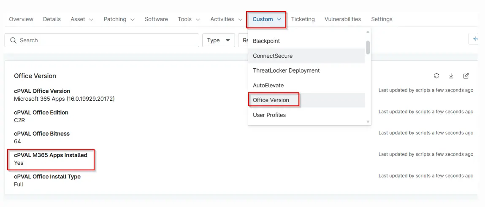

## Summary

Indicates whether Microsoft 365 Apps (Click-to-Run subscription-based Office) are installed on the device.

## Details

| Label | Field Name | Definition Scope | Type | Required | Default Value | Technician Permission | Automation Permission | API Permission | Description | Tool Tip | Footer Text |  Custom Field Tab Name |
| ----- | ---- | ---------------- | ---- | -------- | ------------- | --------------------- | --------------------- | -------------- | ----------- | -------- | ----------- | ----------- |
| cPVAL M365 Apps Installed | cpvalM365AppsInstalled | Device | Text | False |  | Editable | Read_Write | Read_Write | Indicates whether Microsoft 365 Apps (Click-to-Run subscription-based Office) are installed on the device. | Shows Yes if Microsoft 365 Apps are detected; otherwise shows No. | Helps identify devices using Microsoft 365 Apps for licensing and standardization tracking. | Office Version |

## Dependencies

- [Solution - Get Office Version](/docs/19ca26a2-c4f1-4ce1-99a2-b8d37dccfa04) 
- [Script - Get Office Version](/docs/9224179e-e14d-4fe2-95a3-a2304e31e108) 

## Custom Field Creation

[Custom Field Configuration](https://github.com/ProVal-Tech/ninjarmm/blob/main/custom-fields/cpval-m365-apps-installed.toml)

## Sample Screenshot

## Changelog

### 2026-05-27

- Initial version of the document
