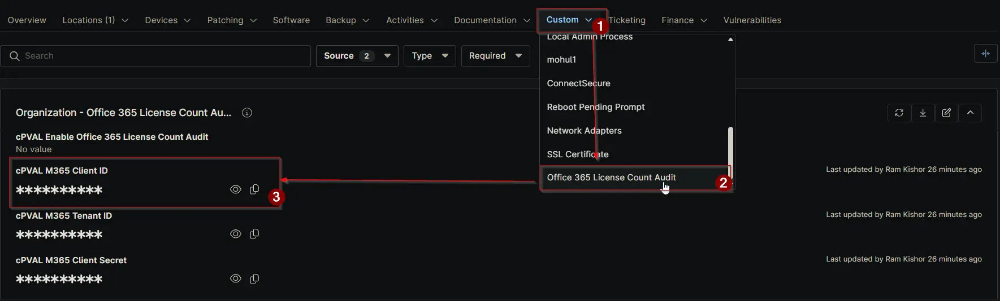

## Summary

Enter the Office 365 Client ID used to establish a secure connection with the tenant. This ID is required for fetching and synchronizing Office 365 license data.

## Details

| Label | Field Name | Definition Scope | Type | Required | Default Value | Technician Permission | Automation Permission | API Permission | Description | Tool Tip | Footer Text | Custom Field Tab Name |
| ----- | ---- | ---------------- | ---- | -------- | ------------- | --------------------- | --------------------- | -------------- | ----------- | -------- | ----------- | ----------- |
| cPVAL M365 Client ID | cpvalM365ClientId | `Organization` | Secure | True | | Editable | Read_Write | Read_Write | Enter the Office 365 Client ID used to establish a secure connection with the tenant. This ID is required for fetching and synchronizing Office 365 license data. | Provide the Office 365 Client ID used to authenticate and retrieve license information from the tenant. | This Client ID enables the system to connect with Office 365 and fetch license usage data for auditing and reporting. | Office 365 License Count Audit |

## Dependencies

- [Solution: Office 365 License Count Audit](/docs/4967b45b-e903-4176-ae5f-c4e095b5cdc5)

## Custom Field Creation

- [Custom Field Configuration](https://github.com/ProVal-Tech/ninjarmm/blob/main/custom-fields/cpval-m365-client-id.toml)

## Sample Screenshot

