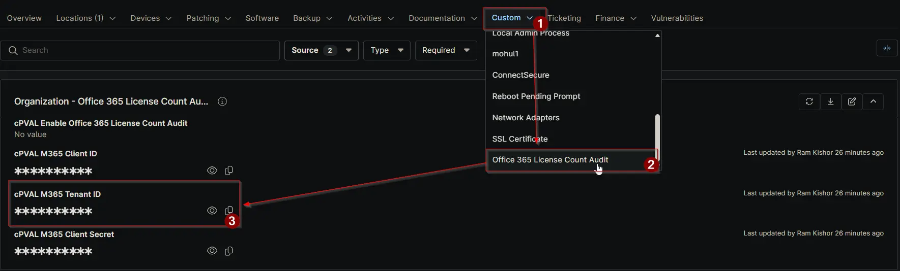

## Summary

Enter the Office 365 Tenant ID associated with the client's Microsoft 365 environment. This identifier is required to connect to the correct tenant for retrieving license data.

## Details

| Label | Field Name | Definition Scope | Type | Required | Default Value | Technician Permission | Automation Permission | API Permission | Description | Tool Tip | Footer Text | Custom Field Tab Name |
| ----- | ---- | ---------------- | ---- | -------- | ------------- | --------------------- | --------------------- | -------------- | ----------- | -------- | ----------- | ----------- |
| cPVAL M365 Tenant ID | cpvalM365TenantId | `Organization` | Secure | True | | Editable | Read_Write | Read_Write | Enter the Office 365 Tenant ID associated with the client's Microsoft 365 environment. This identifier is required to connect to the correct tenant for retrieving license data. | Provide the Office 365 Tenant ID used to identify and connect to the client's Microsoft 365 tenant. | The Tenant ID ensures the system connects to the correct Microsoft 365 tenant to fetch license usage and audit data. | Office 365 License Count Audit |

## Dependencies

- [Solution: Office 365 License Count Audit](/docs/4967b45b-e903-4176-ae5f-c4e095b5cdc5)

## Custom Field Creation

- [Custom Field Configuration](https://github.com/ProVal-Tech/ninjarmm/blob/main/custom-fields/cpval-m365-tenant-id.toml)

## Sample Screenshot

