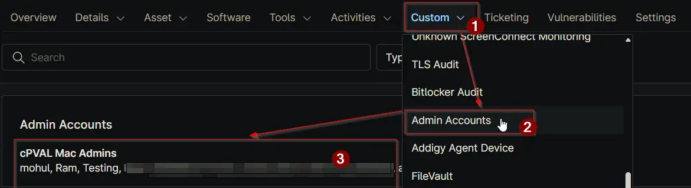

## Summary

This field stores a comma-separated list of local administrator accounts on this macOS device. It automatically excludes the default root account and hidden system accounts to only show actual user or service accounts.

## Details

| Label | Field Name | Definition Scope | Type | Required | Default Value | Technician Permission | Automation Permission | API Permission | Description | Tool Tip | Footer Text |  Custom Field Tab Name |
| ----- | ---- | ---------------- | ---- | -------- | ------------- | --------------------- | --------------------- | -------------- | ----------- | -------- | ----------- | ----------- |
| cPVAL Mac Admins | cpvalMacAdmins | Device | Multi-line | No | N/A | Editable | Read/Write | Read/Write | This field stores a comma-separated list of local administrator accounts on this macOS device. It automatically excludes the default root account and hidden system accounts to only show actual user or service accounts. | Displays the usernames of local administrators on this Mac. Hidden system services and the root user are filtered out for a cleaner list. | Automatically updated by the 'Get macOS Administrator Accounts' script. Displays human and standard service admins only. | Admin Accounts |

## Dependencies

- [Automation: Get macOS Administrator Accounts](/docs/ee0d1171-bad5-4a32-9c07-9cc0098d3618)

## Custom Field Creation

- [Custom Field Configuration](https://github.com/ProVal-Tech/ninjarmm/blob/main/custom-fields/cpval-mac-admins.toml)

## Sample Screenshot

## Changelog

### 2026-04-17

- Initial version of the document.
