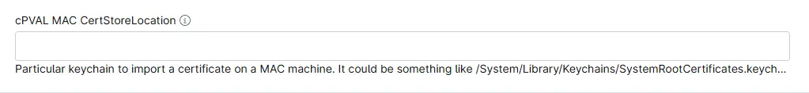

## Summary
Custom Field to add a Particular keychain to import a certificate on a MAC machine. It could be something like /System/Library/Keychains/SystemRootCertificates.keychain, /Users/YourUsername/Library/Keychains/login.keychain, etc. If nothing is mentioned in the parameter, it will use the default system-wide keychain, applying trusted root certificates to the entire system, i.e., /Library/Keychains/System.keychain.

## Details

| Label | Field Name | Definition Scope | Type | Required | Default Value | Technician Permission | Automation Permission | API Permission | Description | Tool Tip | Footer Text |  Custom Field Tab Name |
| ----- | ----- | ----- | ----- | ----- | ----- | ----- | ----- | ----- | ----- | ----- | ----- | ----- | 
| cPVAL MAC CertStoreLocation | cpvalMacCertstorelocation |  `Organization`, `Location`, `Device`  | Text | False | | Read Only | Read/Write | Read/Write | Particular keychain to import a certificate on a MAC machine. Something like /System/Library/Keychains/SystemRootCertificates.keychain, /Users/YourUsername/Library/Keychains/login.keychain, etc. Default : /Library/Keychains/System.keychain | Particular keychain to import a certificate on a MAC machine. Something like /System/Library/Keychains/SystemRootCertificates.keychain, /Users/YourUsername/Library/Keychains/login.keychain, etc. Default : /Library/Keychains/System.keychain | Particular keychain to import a certificate on a MAC machine. Something like /System/Library/Keychains/SystemRootCertificates.keychain, /Users/YourUsername/Library/Keychains/login.keychain, etc. Default : /Library/Keychains/System.keychain | Install Certificate |

## Dependencies

- [Solution - Install Certificates - Windows/Mac](/docs/12034de3-aa3a-4f6c-89da-a6f229e6fbec)

## Custom Field Creation

- [Custom Field Configuration](https://github.com/ProVal-Tech/ninjarmm/blob/main/custom-fields/cpval-mac-certstorelocation.toml)

## Sample Screenshot

## Changelog

### 2026-09-28

- Initial version of the document