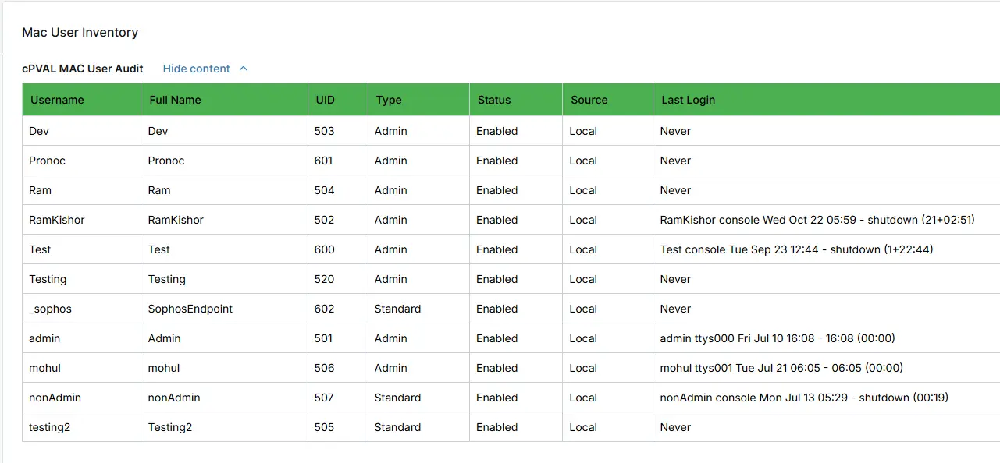

## Summary
Displays local macOS user account details, including username, account type, status, UID, and last login information. It is updated by [Automation - Mac User Audit](/docs/4c215a71-9d5a-4bf4-a9db-c4b4ca4fed97).

## Details

| Label | Field Name | Definition Scope | Type | Required | Default Value | Technician Permission | Automation Permission | API Permission | Description | Tool Tip | Footer Text |  Custom Field Tab Name |
| ----- | ----- | ----- | ----- | ----- | ----- | ----- | ----- | ----- | ----- | ----- | ----- | ----- | 
|cPVAL MAC User Audit |  cpvalMacUserAudit | Devices | WYSIWYG | False | | Read Only | Read/Write | Read/Write | Displays local macOS user account details, including username, account type, status, UID, and last login information. It is updated by `Mac User Audit` Script. | Displays local macOS user account details, including username, account type, status, UID, and last login information.|Displays local macOS user account details, including username, account type, status, UID, and last login information. | Mac User Inventory | 

## Dependencies

- [Automation - Mac User Audit](/docs/4c215a71-9d5a-4bf4-a9db-c4b4ca4fed97)
- [Solution - Mac Users Audit](/docs/d4d9f6a6-92f9-4a6c-a197-136ff523c547)

## Custom Field Creation

- [Custom Field Configuration](https://github.com/ProVal-Tech/ninjarmm/blob/main/custom-fields/cpval-mac-user-audit.toml)

## Sample Screenshot

## Changelog

### 2026-08-14

- Initial version of the document

