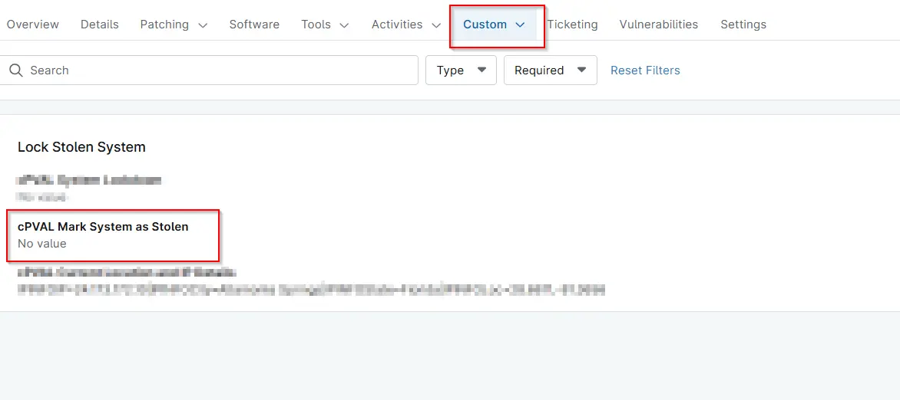

## Summary
Mark this Custom Field to mark a Computer as stolen. Selecting this, will enable `Lock Stolen System solution` on the machine.

## Details

| Label | Field Name | Definition Scope | Type | Required | Default Value | Technician Permission | Automation Permission | API Permission | Description | Tool Tip | Footer Text |  Custom Field Tab Name |
| ----- | ---- | ---------------- | ---- | -------- | ------------- | --------------------- | --------------------- | -------------- | ----------- | -------- | ----------- | ----------- |
| cPVAL Mark System as Stolen | cpvalMarkSystemAsStolen | `Devices` | Checkbox | No | |  Editable | Read_Write | Read_Write | Mark this Custom Field to mark a Computer as stolen. Selecting this, will enable `Lock Stolen System solution` on the machine | Select this Custom Field to mark a Computer as stolen.| Select this Custom Field to mark a Computer as stolen. | Lock Stolen System |

## Dependencies
- [Solution  - Lock Stolen System](/docs/13b4df99-df9b-4a57-bc0f-8675c68be028)

## Custom Field Creation

- [Custom Field Configuration](https://github.com/ProVal-Tech/ninjarmm/blob/main/custom-fields/cpval-mark-system-as-stolen.toml)

## Sample Screenshot

  