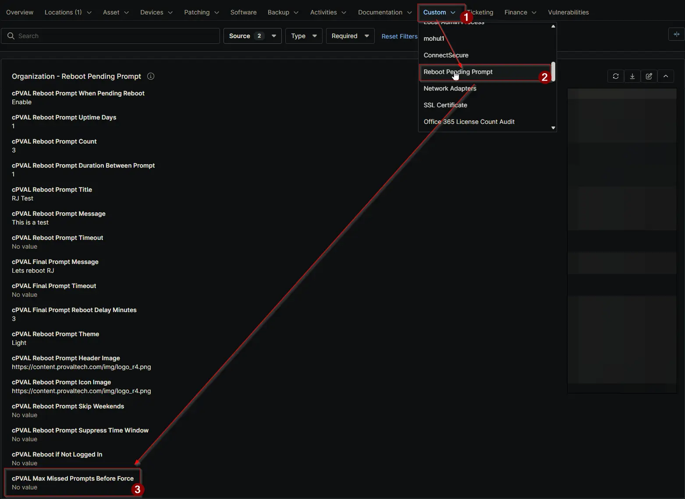

## Summary

Max consecutive misses allowed before forcing a reboot. Set to 0 to disable forced reboots (tracking still occurs).

## Details

| Label | Field Name | Definition Scope | Type | Required | Default Value | Technician Permission | Automation Permission | API Permission | Description | Tool Tip | Footer Text | Org Level Tab | Location Level Tab | Device Level Tab |
| ----- | ---- | ---------------- | -------- | ------------- | ---------------- | --------------------- | --------------------- | -------------- | ----------- | -------- | ----------- | ----------- | ----------- | ----------- |
| cPVAL Max Missed Prompts Before Force | cpvalMaxMissedPromptsBeforeForce | Organization, Location, Device | Integer | False | `0` | Editable | Read_Write | Read_Write | Max consecutive misses allowed before forcing a reboot. Set to 0 to disable forced reboots (tracking still occurs). | If > 0, forces reboot when reached. If 0, forced reboot is disabled, but the skip counter still tracks normally. | Default: 0 (Disabled). Set at Org/Location level. | Reboot Pending Prompt | Reboot Pending Prompt | Reboot Pending Prompt - Workstations |

## Dependencies

- [Solution: Reboot Pending Prompt](/docs/d7758fa4-9fcc-4259-a7a5-0ca65dda10eb)

## Custom Field Creation

- [Custom Field Configuration](https://github.com/ProVal-Tech/ninjarmm/blob/main/custom-fields/cpval-max-missed-prompts-before-force.toml)

## Sample Screenshot

## Changelog

### 2026-06-03

- Initial version of the document
