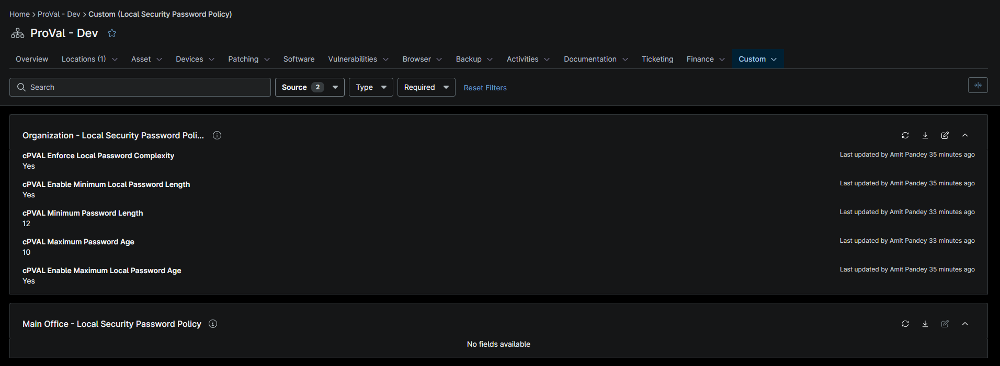

## Summary

Provide the maximum age in days for the maximum local password age policy. The valid range is between 4 and 360.

## Details

| Label | Field Name | Example | Definition Scope | Type | Required | Default Value | Editable | Custom Field Tab |
| ----- | ---------- | ------- | ---------------- | ---- | -------- | ------------- | ---------------- | -------- |
| cPVAL Maximum Password Age | cpvalMaximumPasswordAge | True | `Organization` | Checkbox | True |  |  True | Local Security Password Policy |

## Dependencies

- [Solution: Set Workstation Local Password Policy](/docs/72e89e20-3771-450a-a89a-b6e27d9c46b5)

## Custom Field Creation

- [Custom Field Configuration](https://github.com/ProVal-Tech/ninjarmm/blob/main/custom-fields/cpval-maximum-password-age.toml)

## Sample Screenshot

## Changelog

### 2026-10-07

- Initial version of the document