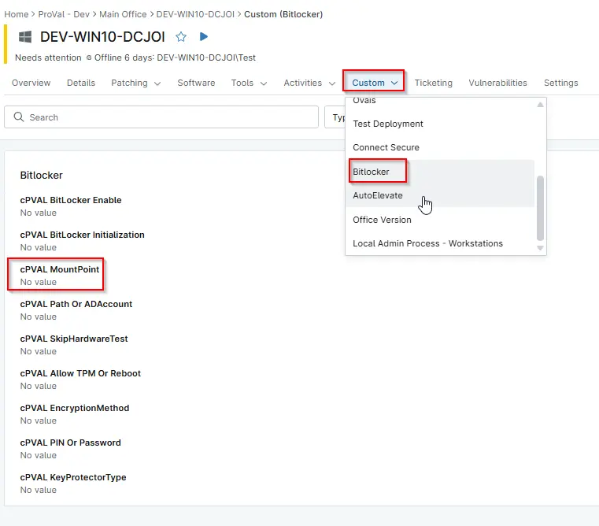

## Summary

The target volume to enable BitLocker encryption against. Should be in the format '\<driveletter\>' or '\<driveletter\>:'. If a path is passed, the drive of that path will be attempted to be parsed. Defaults to `$env:SystemDrive`.

## Details

| Label | Field Name | Definition Scope | Type | Required | Default value | Technician Permission | Automation Permission | API Permission | Description | Tool Tip | Footer Text | Custom Field Tab Name |
| ----- | ---- | ---------------- | ---- | -------- | ------------- | --------------------- | --------------------- | -------------- | ----------- | -------- | ----------- | ----------- |
| cPVAL MountPoint | cpvalMountpoint | `Organizations`,`Devices`,`Location` | Text | | $env:SystemDrive | Editable | Read_Write | Read_Write | The target volume to enable BitLocker encryption against. Should be in the format `'\<driveletter\>'` or `'\<driveletter\>:'`. If a path is passed, the drive of that path will be attempted to be parsed. Defaults to `$env:SystemDrive`. | Specifies the drive letter or mount point where BitLocker should be enabled. Defaults to the system drive if not provided. | The drive or mount point targeted for BitLocker encryption. Use a drive letter `(e.g., C:)` or a valid path to ensure the correct volume is selected. | BitLocker |

## Dependencies

- [Automation - Initialize BitLocker](/docs/e3a24552-f347-4117-82f5-7afaaa3fc198)
- [Solution - BitLocker Initialize - NinjaOne](/docs/2ebfabd5-05cf-4175-a513-2aa290eb26e8)

## Custom Field Creation

[Custom Field Configuration](https://github.com/ProVal-Tech/ninjarmm/blob/main/custom-fields/cpval-mountpoint.toml)

## Sample Screenshot

  
