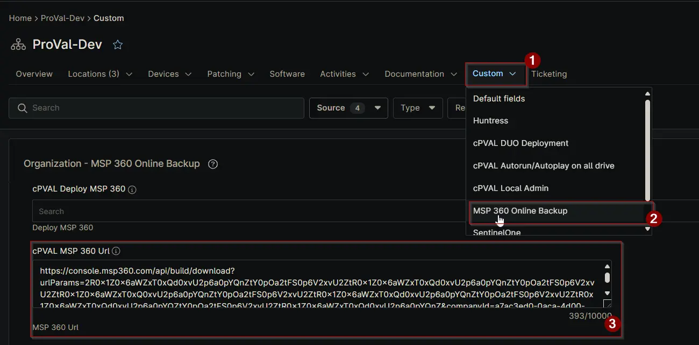

## Summary

This stores the MBS backup agent URL. Copy the link from MBS portal in Downloads section.

**Notes:**

- The MBS Backup Agent URL should be configured in this Custom Field to enable the client to use [Install MSP360 Online Backup](/docs/104e0456-6bb4-4e65-b0c0-0f8b6c0a4d8b) script.

## Details

| Label | Field Name | Definition Scope | Type | Required | Default Value | Technician Permission | Automation Permission | API Permission | Description | Tool Tip | Footer Text | Organization Custom Field Tab Name |
| ----- | ---- | ---------------- | ---- | -------- | ------------- | --------------------- | --------------------- | -------------- | ----------- | -------- | ----------- | ----------- |
| cPVAL MSP 360 Url | cpvalMsp360Url | Organization | Text_multiline | false |  | `Editable` | `Read/Write` | `Read/Write` | MBS backup agent URL. Copy the link from MBS portal in Downloads section. | MBS backup agent URL. Copy the link from MBS portal in Downloads section. | MSP 360 Url | MSP 360 Online Backup |

## Dependencies

- [MSP360 Online Backup Deployment](/docs/2f783bba-4022-43d3-8bb4-a768f68fe8c2)

## Custom Field Creation

[Custom Field Configuration](https://github.com/ProVal-Tech/ninjarmm/blob/main/custom-fields/cpval-msp-360-url.toml)

## Sample Screenshot

