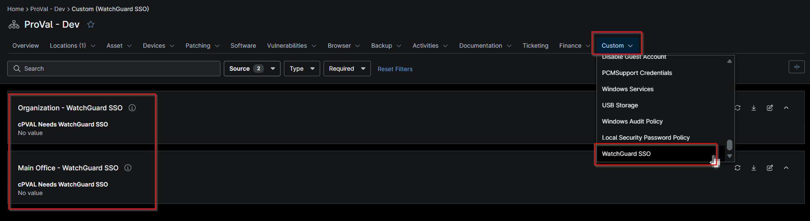

## Summary

This custom field needed to be selected for the installation of the WatchGuard SSO Client on Windows workstations or Windows Server.

## Details

| Label | Field Name | Example | Definition Scope | Type | Required | Default Value | Dropdown Options | Editable | Custom Field Tab |
| ----- | ---------- | ------- | ---------------- | ---- | -------- | ------------- | ---------------- | -------- | ---------------- |
| cPVAL Needs WatchGuard SSO | cpvalNeedsWatchguardSso | Windows | `Organization`, `Location` | Drop-down | true |  |  | yes | WatchGuard SSO |

## Dependencies

- [Solution - Install WatchGuard Authentication Client 12.7.0](/docs/27fd43e4-e9f8-4e02-a2ae-1a7b0e2b12f7)

## Custom Field Creation

- [Custom Field Configuration](https://github.com/ProVal-Tech/ninjarmm/blob/main/custom-fields/cpval-needs-watchguard-sso.toml)

## Sample Screenshot

## Changelog

### 2026-10-05

- Initial version of the document
