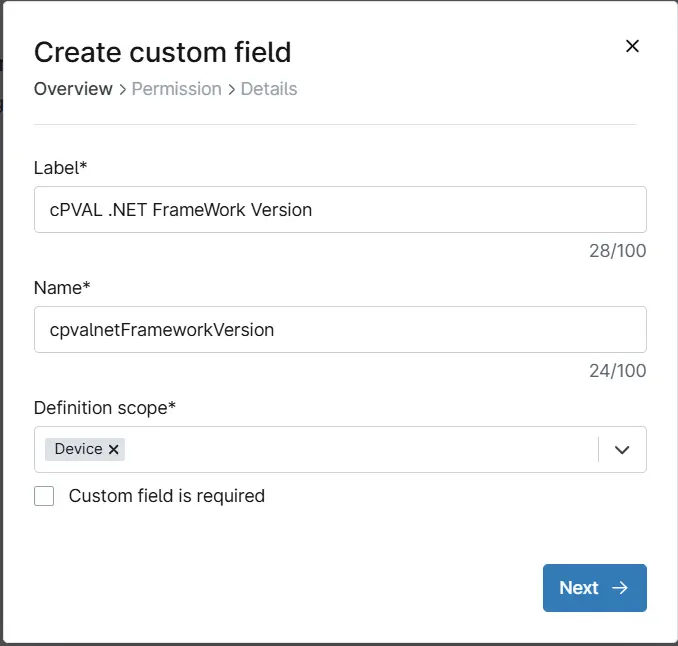

## Summary
This custom field stores the installed .NET Framework version on a device, retrieved using the script `Get - .Net Framework Version [CF]`.

## Details

| Label | Field Name | Definition Scope | Type | Required | Default Value | Technician Permission | Automation Permission | API Permission | Description | Tool Tip | Footer Text |
| ----- | ---- | ---------------- | ---- | -------- | ------------- | --------------------- | --------------------- | -------------- | ----------- | -------- | ----------- |
|cPVAL .NET FrameWork Version|cpvalnetFrameworkVersion|Device|Text|True|-|Editable|Read/Write|Read/Write|This custom field stores the installed .NET Framework version on a device, retrieved using the script `Get - .Net Framework Version [CF]`.|-|-|

## Dependencies
[Automation - Get - .Net Framework Version [CF]](/docs/da0dccbe-ef31-4627-ac10-e242828102e0)  
[Task - Get - .Net Framework Version](/docs/7064a8be-8470-4ca4-a1a6-13f70a242b8c)

## Custom Field Creation

### Step 1

Navigate to the `Administration` menu, then proceed to `Devices` and select `Global Custom Fields`.  

### Step 2

Locate the `Add` button on the right-hand side of the screen and click on it.  
  

### Step 3

After clicking the `Add` button, select the `Field` button that appears.  

The following Pop-up screen will appear:  

### Step 4
Custom Field Type: text
Select Drop-down for the Custom field type and click Continue to proceed.

The following Pop-up screen will appear:

### Step 5
Set the following details in the Overview section and click the Next button.

Label: cPVAL .NET FrameWork Version  
Name: cpvalnetFrameworkVersion  
Definition Scope: Device  
Custom field is required: <Leave it unchecked>  

### Step 6
Clicking the Next button will take you to the Permission section.

Set the following details in the Permission section and click the Next button.

Technician: Editable
Automation: Read/Write
API: Read/Write

### Step 7
Clicking the Next button will take you to the details tab.

Fill in the following information in the Details section and click the Next button.

Description: This custom field stores the installed .NET Framework version on a device, retrieved using the script `Get - .Net Framework Version [CF]`.  
Tooltip Text: -  
Footer Text: -  

Click on create button to create the Custom Field.

### Completed Custom Field

### Example

