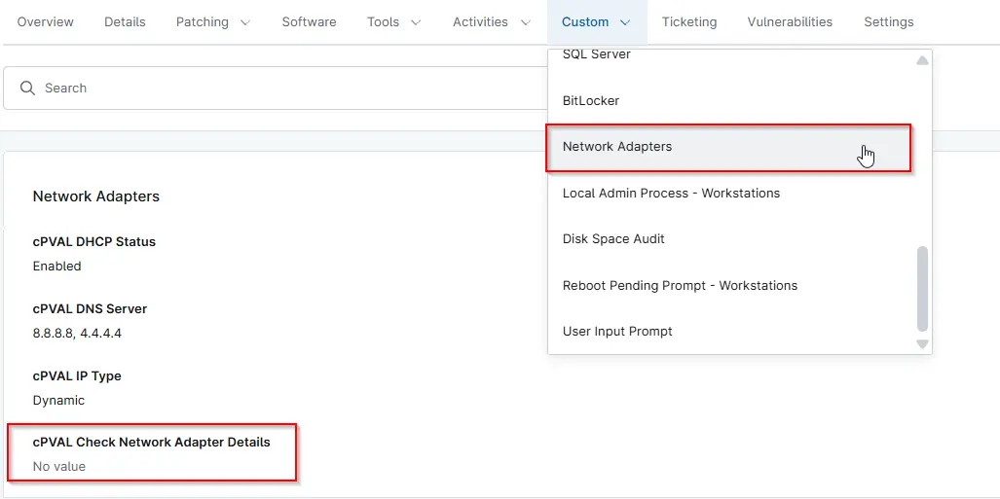

## Summary

This Custom Field is used during the Network Adapter Details check as part of compound execution conditions. It determines whether the script should run on a device based on the defined deployment and execution logic.

## Details

| Label                         | Field Name                 | Definition Scope | Type      | Required | Available Options                                                                                    | Default Value | Technician Permission | Automation Permission | API Permission | Description                                                                                                                                                                                                               | Tool Tip                                                        | Footer Text                                           | Custom Field Tab Name |
| ----------------------------- | -------------------------- | ---------------- | --------- | -------- | ---------------------------------------------------------------------------------------------------- | ------------- | --------------------- | --------------------- | -------------- | ------------------------------------------------------------------------------------------------------------------------------------------------------------------------------------------------------------------------- | --------------------------------------------------------------- | ----------------------------------------------------- | --------------------- |
| cPVAL Check Network Adapter Details | cpvalCheckNetworkAdapterDetails | `Device`, `Organization`, `Location`       | Drop-down | --       | `Disabled`, `Windows`, `Windows Workstations`, `Windows Servers`              | --            | Editable              | Read/Write            | Read/Write     | This Custom Field is used during the Network Adapter Details check as part of compound execution conditions. It determines whether the script should run on a device based on the defined deployment and execution logic. | Controls script execution logic for Network Adapter validation. | Used internally for deployment and execution control. | Network Adapters       |

## Dependencies

- [Get - Network Adapter details](/docs/50ff2168-46f2-4c9b-8ccc-0d3671178267)
- [Solution - Network Adapter Details](/docs/81d8fa31-72c7-4339-a107-4a41a3e489f5)
- [Compound Condition - Check Network Adapter Details - Workstations](/docs/5b8facb5-f73d-45d2-b06e-58ffc6b5ce61)
- [Compound Condition - Check Network Adapter Details - Servers](/docs/3c1b4d06-33e8-4e0c-8f2c-3bc93ebd36ae)

## Custom Field Creation

- [Custom Field Configuration](https://github.com/ProVal-Tech/ninjarmm/blob/main/custom-fields/cpval-network-adapter-details.toml)

## Sample Screenshot

