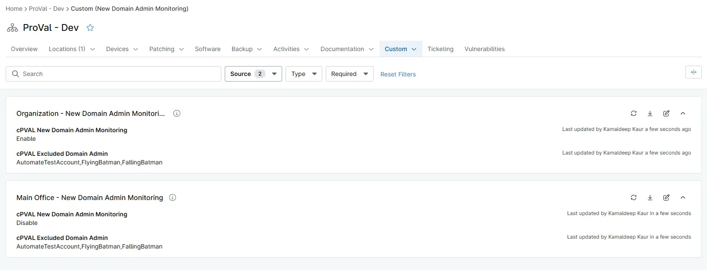

## Summary

Select Enable to enable New Domain Admin monitoring. Disable can be selected at Computer or Location level for excluding them.

## Details

| Label | Field Name | Definition Scope | Type | Required | Default Value | Technician Permission | Automation Permission | API Permission | Description | Tool Tip | Footer Text | Organization Level Custom Field Tab | Location Level Custom Field Tab | Device Level Custom Field Tab |
| ----- | ---- | ---------------- | ---- | -------- | ------------- | --------------------- | --------------------- | -------------- | ----------- | -------- | ----------- |----------- |----------- |----------- |
|cPVAL New Domain Admin Monitoring| cpvalNewDomainAdminMonitoring | Device,Organization,Location | Dropdown | No | Enable,Disable | Read Only | Read_Write | Read_Write | Select Enable to enable New Domain Admin monitoring. Disable can be selected at Computer or Location level for excluding them. | Select Enable to enable New Domain Admin monitoring. Disable can be selected at Computer or Location level for excluding them. | | New Domain Admin Monitoring | New Domain Admin Monitoring | New Domain Admin Monitoring Device  |

## Dependencies

- [Script : New Domain Admin Detected](/docs/a818ac38-9841-4049-9fda-1b87fa1bd19a)
- [Condition : New Domain Admin Detected](/docs/b300f17d-63ee-4c31-b29b-a9fb92a69a89)
- [Ticket Template : New Domain Admin Detected](/docs/355a03b6-61f8-45c4-92f9-43f13b5dd7ac)
- [Solution : New Domain Admin Detected](/docs/ffbbe3fe-f579-4521-a95a-1eb772d93ac7)

## Custom Field Creation

[Custom Field Configuration](https://github.com/ProVal-Tech/ninjarmm/blob/main/custom-fields/cpval-new-domain-admin-monitoring.toml)

## Sample Screenshot

