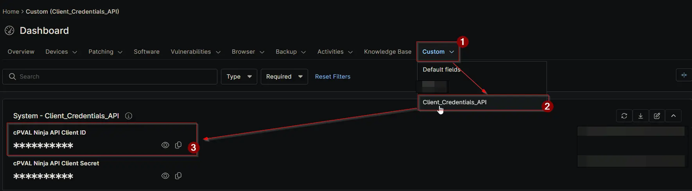

## Summary

Stores the **Client ID** of the NinjaOne API application that [Application Installation Report - Organization and Global KB](/docs/d128edba-4851-4810-8b99-c94e0ac0780a) automation uses to authenticate against the NinjaOne Public API.

The Public API uses the OAuth 2.0 client credentials grant for machine-to-machine access. The Client ID identifies which registered API application is making the request; it is paired with the [cPVAL Ninja API Client Secret](/docs/58b01634-4e1a-4793-aafd-18526ea8c80e), which authenticates it. Both values are issued together when the API application is created in NinjaOne under **Administration → Apps → API**, and the application must be configured with the *Client Credentials* grant type and granted the scopes the dependent automations require.

This field is populated once during setup and read by automations at runtime, so no credential needs to be passed into individual script executions. If the API application is ever deleted and recreated, update this field with the new Client ID — automations will fail to obtain an access token until both halves of the credential match the application registered in NinjaOne.

Although a Client ID is not confidential in the way a secret is, the field is defined as a **Secure** type so that both halves of the credential are stored and handled consistently.

## Details

| Label | Field Name | Example | Definition Scope | Type | Required | Default Value | Editable | Custom Field Tab |
| ----- | ---------- | ------- | ---------------- | ---- | -------- | ------------- | -------- | ---------------- |
| `cPVAL Ninja API Client ID` | `cpvalNinjaApiClientId` | `8GIo0Y646lsxWXj5HBO6RcUoKY7` | `System` | `Secure` | `Yes` | | `Yes` | `Client_Credentials_API` |

## Dependencies

- [Custom Field: cPVAL Ninja API Client Secret](/docs/58b01634-4e1a-4793-aafd-18526ea8c80e)
- [Automation: Application Installation Report - Organization and Global KB](/docs/d128edba-4851-4810-8b99-c94e0ac0780a)
- [Solution: Application Installation Reporting](/docs/4de25a7e-823c-4b69-8048-8c00f65e1c17)

## Custom Field Creation

- [Custom Field Configuration](https://github.com/ProVal-Tech/ninjarmm/blob/main/custom-fields/cpval-ninja-api-client-id.toml)

## Sample Screenshot

## Changelog

### 2026-09-16

- Initial version of the document
