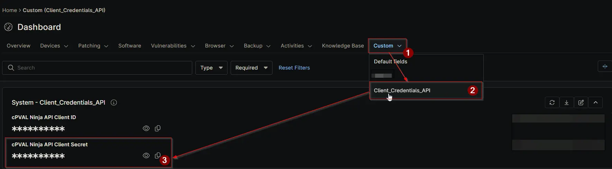

## Summary

Stores the **Client Secret** of the NinjaOne API application that [Application Installation Report - Organization and Global KB](/docs/d128edba-4851-4810-8b99-c94e0ac0780a) automation uses to authenticate against the NinjaOne Public API.

Paired with the [cPVAL Ninja API Client ID](/docs/32142af2-d352-4d0d-9ec3-9dae0a5fef88), this value proves that a token request genuinely originates from the registered API application. Automations exchange the two for a short-lived access token at runtime, so the secret itself is never embedded in script parameters or passed between automations.

NinjaOne displays the Client Secret **only once**, at the moment the API application is created. Copy it into this field during setup; if it is lost, it cannot be retrieved and a new secret must be generated, at which point this field must be updated. Generating a new secret invalidates the previous one immediately, so schedule rotation alongside the field update to avoid dependent reports failing in between.

The field is defined as a **Secure** type: the stored value is masked in the interface and is not readable by standard users, while remaining available to authorised automations at runtime. Treat it as a privileged credential — anyone able to read it can act against the NinjaOne API with the full scope granted to the API application.

## Details

| Label | Field Name | Example | Definition Scope | Type | Required | Default Value | Editable | Custom Field Tab |
| ----- | ---------- | ------- | ---------------- | ---- | -------- | ------------- | -------- | ---------------- |
| `cPVAL Ninja API Client Secret` | `cpvalNinjaApiClientSecret` | `67h5w58GIo0Y646lsxWXj5HBO6RcUoKY70L5ywyy6aggw2rYK0T01kGp` | `System` | `Secure` | `Yes` | | `Yes` | `Client_Credentials_API` |

## Dependencies

- [Custom Field: cPVAL Ninja API Client ID](/docs/32142af2-d352-4d0d-9ec3-9dae0a5fef88)
- [Automation: Application Installation Report - Organization and Global KB](/docs/d128edba-4851-4810-8b99-c94e0ac0780a)
- [Solution: Application Installation Reporting](/docs/4de25a7e-823c-4b69-8048-8c00f65e1c17)

## Custom Field Creation

- [Custom Field Configuration](https://github.com/ProVal-Tech/ninjarmm/blob/main/custom-fields/cpval-ninja-api-client-secret.toml)

## Sample Screenshot

## Changelog

### 2026-09-16

- Initial version of the document
