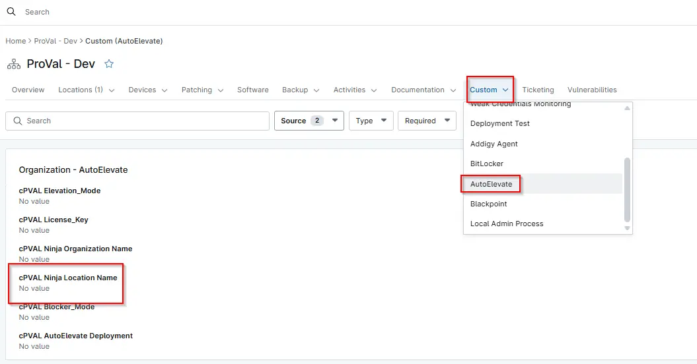

## Summary

Location is used during the AutoElevate agent deployment to ensure the installed agent is assigned to the correct location within the AutoElevate portal

## Details

| Label                          | Field Name                 | Definition Scope | Type | Required | Default Value | Technician Permission | Automation Permission | API Permission | Description                             | Tool Tip | Footer Text | Custom Field Tab Name |
| ------------------------------ | -------------------------- | ---------------- | ---- | -------- | ------------- | --------------------- | --------------------- | -------------- | --------------------------------------- | -------- | ----------- | --------------------- |
| cPVAL Ninja Location Name | cpvalNinjalocationname | `Organization`, `Location`, `Device`      | Text | No     | -             | Editable              | Read/Write            | Read/Write     | Used to hold the Ninja Location Name data or grab the Ninja Location Name fron Ninja that is used within the script. | Ninja Location Name       | Ninja Location Name         | 
| cPVAL Ninja Location Name | cpvalNinjalocationname | `Organization`, `Location`, `Device`      | Text | No     | -             | Editable              | Read/Write            | Read/Write     | Used to hold the Ninja Location Name data or grab the Ninja Location Name fron Ninja that is used within the script. | Ninja Location Name       | Ninja Location Name         | AutoElevate     |

## Dependencies

- [AutoElevate Agent Deployment](/docs/45b83c20-5a25-4321-a253-5239633ecbd4)

## Custom Field Creation

- [Custom Field Configuration](https://github.com/ProVal-Tech/ninjarmm/blob/main/custom-fields/cpval-ninja-location-name.toml)

## Sample Screenshot

