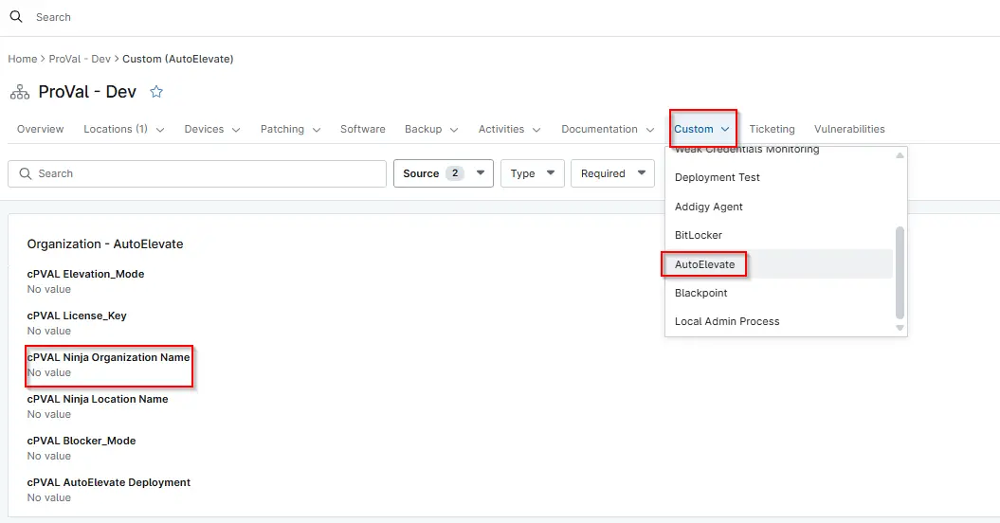

## Summary

Organization Name is used during the AutoElevate agent deployment to ensure that the installed agent appears under the correct organization within the AutoElevate portal.

## Details

| Label                          | Field Name                 | Definition Scope | Type | Required | Default Value | Technician Permission | Automation Permission | API Permission | Description                             | Tool Tip | Footer Text | Custom Field Tab Name |
| ------------------------------ | -------------------------- | ---------------- | ---- | -------- | ------------- | --------------------- | --------------------- | -------------- | --------------------------------------- | -------- | ----------- | --------------------- |
| cPVAL Ninja Organization Name | cpvalNinjaorganizationname | `Organization`, `Location`, `Device`     | Text | No     | -             | Editable              | Read/Write            | Read/Write     | Used to hold the Ninja organization Name data or grab the Ninja organization Name from Ninja that is used within the script. | Ninja Organization Name       | Ninja Organization Name         | AutoElevate     |

## Dependencies

- [AutoElevate Agent Deployment](/docs/45b83c20-5a25-4321-a253-5239633ecbd4)

## Custom Field Creation

- [Custom Field Configuration](https://github.com/ProVal-Tech/ninjarmm/blob/main/custom-fields/cpval-ninja-organization-name.toml)

## Sample Screenshot

