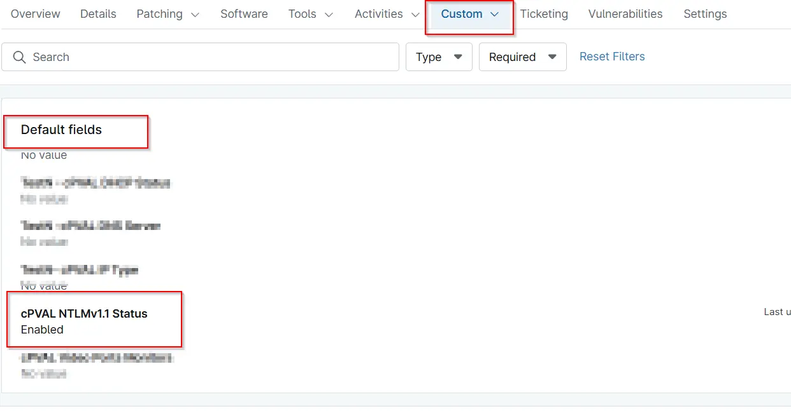

## Summary
This Custom Field displays if NTLMv1.1 is enabled or not on windows machines. Data is populated by [Check NTLMv1.1 Status ](/docs/597320a1-4278-490d-ad99-0127cace9424) automation.

## Details

| Label | Field Name | Definition Scope | Type | Required | Default Value | Technician Permission | Automation Permission | API Permission | Description | Tool Tip | Footer Text |  Custom Field Tab Name |
| ----- | ---- | ---------------- | ---- | -------- | ------------- | --------------------- | --------------------- | -------------- | ----------- | -------- | ----------- | ----------- |
| cPVAL NTLMv1.1 Status | cpvalNtlmv11Status | Device | Text | False | - | Editable  | Read/Write   | Read/Write  | This Custom Field displays if NTLMv1.1 is enabled or not on windows machines. Data is populated by `Check NTLMv1.1 Status` automation | This Custom Field displays if NTLMv1.1 is enabled or not on windows machines. | NTLMv1.1 Status | Default |

## Dependencies

- [Solution - NTLMv1.1 ](/docs/94b6df2a-8565-4118-b2e7-35a3fe7206dc)

## Custom Field Creation

- [Custom Field Configuration](https://github.com/ProVal-Tech/ninjarmm/blob/main/custom-fields/cpval-ntlmv11-status.toml)

## Sample Screenshot

