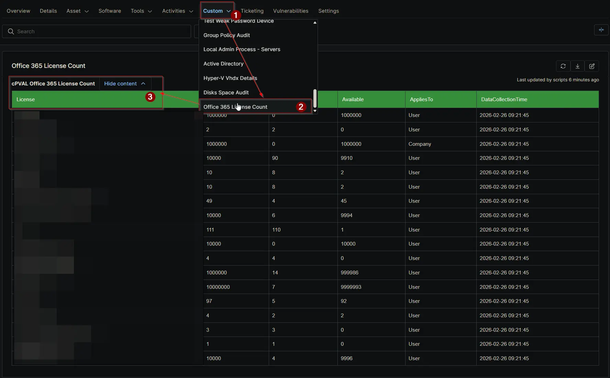

## Summary

Displays a table of Office 365 license information gathered by the auditing script.

## Details

| Label | Field Name | Definition Scope | Type | Required | Default Value | Technician Permission | Automation Permission | API Permission | Description | Tool Tip | Footer Text | Custom Field Tab Name |
| ----- | ---- | ---------------- | ---- | -------- | ------------- | --------------------- | --------------------- | -------------- | ----------- | -------- | ----------- | ----------- |
| cPVAL Office 365 License Count | cpvalOffice365LicenseCount | `Device` | WYSIWYG | True | | Editable | Read_Write | Read_Write | Displays a table of Office 365 license information gathered by the auditing script. | Shows a table of Office 365 license details retrieved by the auditing script. | Information reflects the latest results from the automated Office 365 license audit. | Office 365 License Count |

## HTML Table Column Definitions

| Column Name        | Description |
| ----               | ---- |
| License            | The specific SKU Part Number (e.g., SPE_E3, ENTERPRISEPACK). |
| Total              | The total number of prepaid, enabled units purchased for this license type. |
| Assigned           | The number of units currently consumed or assigned to users/resources. |
| Available          | Calculated field (Total minus Assigned). Indicates licenses free to be assigned. |
| AppliesTo          | Indicates the target of the license (e.g., User, Device, Company). |
| DataCollectionTime | The local timestamp when the script successfully queried the Graph API. |

## Dependencies

- [Automation: Office 365 License Count](/docs/2caca618-6249-4f67-8bee-94538f69dae3)
- [Solution: Office 365 License Count Audit](/docs/4967b45b-e903-4176-ae5f-c4e095b5cdc5)

## Custom Field Creation

- [Custom Field Configuration](https://github.com/ProVal-Tech/ninjarmm/blob/main/custom-fields/cpval-office-365-license-count.toml)

## Sample Screenshot

