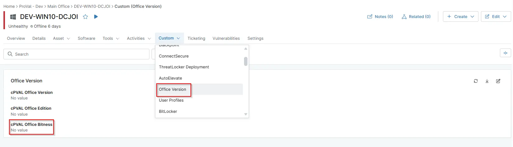

## Summary
Stores the Office Bitness on the machine fetched by [Get Office Version](/docs/9224179e-e14d-4fe2-95a3-a2304e31e108) script.

## Details

| Label | Field Name | Definition Scope | Type | Required | Default Value | Technician Permission | Automation Permission | API Permission | Description | Tool Tip | Footer Text |  Custom Field Tab Name |
| ----- | ---- | ---------------- | ---- | -------- | ------------- | --------------------- | --------------------- | -------------- | ----------- | -------- | ----------- | ----------- |
| cPVAL Office Bitness | cpvalOfficebitness | Device | Text | False |  | Editable | Read_Write | Read_Write | Office Bitness on the machine fetched by `Get Office Bitness` script. | Office Bitness on the machine fetched by `Get Office Bitness` script. | Office Bitness on the machine fetched by `Get Office Bitness` script. | Office Version |

## Dependencies
- [Solution - Get Office Version](/docs/19ca26a2-c4f1-4ce1-99a2-b8d37dccfa04) 
- [Script - Get Office Version](/docs/9224179e-e14d-4fe2-95a3-a2304e31e108) 

## Custom Field Creation

[Custom Field Configuration](https://github.com/ProVal-Tech/ninjarmm/blob/main/custom-fields/cpval-office-bitness.toml)

## Sample Screenshot

## Changelog

### 2026-05-12

- Initial version of the document
