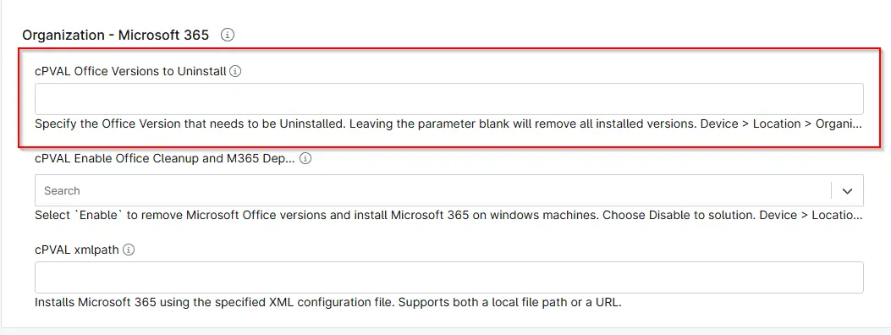

## Summary
Custom Field to specify the Office Version that needs to be Uninstalled. If this custom field is blank on all device, location and organization level, [Script - Office Cleanup and M365 Deployment](/docs/de0e7e1f-6f29-41b2-9d65-164b2e2c4431) will use the script parameter  `Versions to Uninstall`. And if it is also blank, script will uninstall all installed versions.

## Details

| Label | Field Name | Definition Scope | Type | Required | Default Value | Technician Permission | Automation Permission | API Permission | Description | Tool Tip | Footer Text |  Custom Field Tab Name |
| ----- | ---- | ---------------- | ---- | -------- | ------------- | --------------------- | --------------------- | -------------- | ----------- | -------- | ----------- | ----------- |
| cPVAL Office Versions to Uninstall | cpvalOfficeVersionsToUninstall | Device/Location/Organization | Text | false | - | Editable | Read_Write | Read_Write | Specify the Office Version that needs to be Uninstalled. Leaving the parameter blank will remove all installed versions. Device > Location > Organization in precedence. | Specify the Office Version that needs to be Uninstalled. Leaving the parameter blank will remove all installed versions. Device > Location > Organization in precedence. | Specify the Office Version that needs to be Uninstalled. Leaving the parameter blank will remove all installed versions. Device > Location > Organization in precedence.| Microsoft 365 |

## Dependencies

- [Solution: Office Cleanup and M365 Deployment](/docs/f5efe485-4c55-4fe0-88db-05c06305b101)

## Custom Field Creation

- [Custom Field Configuration](https://github.com/ProVal-Tech/ninjarmm/blob/main/custom-fields/cpval-office-versions-to-uninstall.toml)

## Sample Screenshot

## Changelog

### 2026-30-04

- Initial version of the document