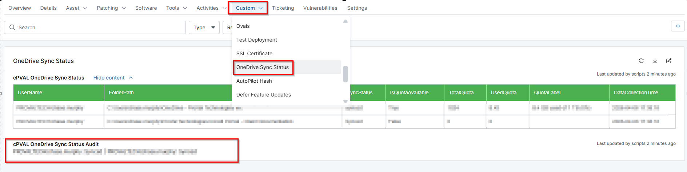
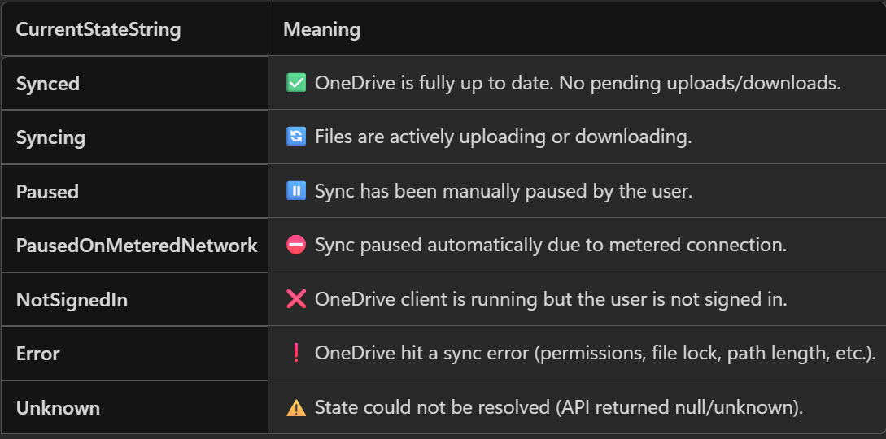

## Summary
This device custom field stores the OneDrive Sync Status gathered by the automation [Get OneDrive Sync Status](/docs/29e62bb2-d641-472d-a92b-11404471b915).
It can be used to audit the agents where sync is failed.

## Details

| Label | Field Name | Definition Scope | Type | Required | Default Value | Technician Permission | Automation Permission | API Permission | Description | Tool Tip | Footer Text |  Custom Field Tab Name |
| ----- | ---- | ---------------- | ---- | -------- | ------------- | --------------------- | --------------------- | -------------- | ----------- | -------- | ----------- | ----------- |
| cPVAL OneDrive Sync Status Audit | cpvalOnedriveSyncStatusAudit | `Device` | Text | False |  | Read-Only | Read/Write | Read/Write | The customfield stores the OneDrive Sync Status state so that it can be used to audit the agents where sync has failed. |  |  | OneDrive Sync Status |

## Dependencies

- [Script - Get OneDrive Sync Status](/docs/29e62bb2-d641-472d-a92b-11404471b915)
- [Solution - Get OneDrive Sync Status](/docs/22d8abe0-2ea4-48e9-8b02-6108cd2de889)

## Custom Field Creation

- [cPVAL OneDrive Sync Status](https://github.com/ProVal-Tech/ninjarmm/blob/main/custom-fields/cpval-onedrive-sync-status-audit.toml)

## Sample Screenshot

Custom field screenshot:

Possible outcomes of the sync status:

## Changelog

### 2026-04-08

- Initial version of the document
