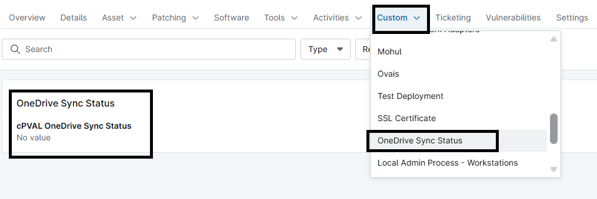

## Summary
This device custom field stores the OneDrive Sync Status gathered by the automation [Get OneDrive Sync Status](/docs/29e62bb2-d641-472d-a92b-11404471b915).

## Details

| Label | Field Name | Definition Scope | Type | Required | Default Value | Technician Permission | Automation Permission | API Permission | Description | Tool Tip | Footer Text |  Custom Field Tab Name |
| ----- | ---- | ---------------- | ---- | -------- | ------------- | --------------------- | --------------------- | -------------- | ----------- | -------- | ----------- | ----------- |
| cPVAL OneDrive Sync Status | cpvalOnedriveSyncStatus | `Device` | WYSIWYG | False |  | Editable | Read/Write | Read/Write | The custom field stores the OneDrive Sync Status |  |  | OneDrive Sync Status |

## Dependencies

- [Script - Get OneDrive Sync Status](/docs/29e62bb2-d641-472d-a92b-11404471b915)

## Custom Field Creation

- [cPVAL OneDrive Sync Status](https://github.com/ProVal-Tech/ninjarmm/blob/main/custom-fields/cpval-onedrive-sync-status.toml)

## Sample Screenshot

