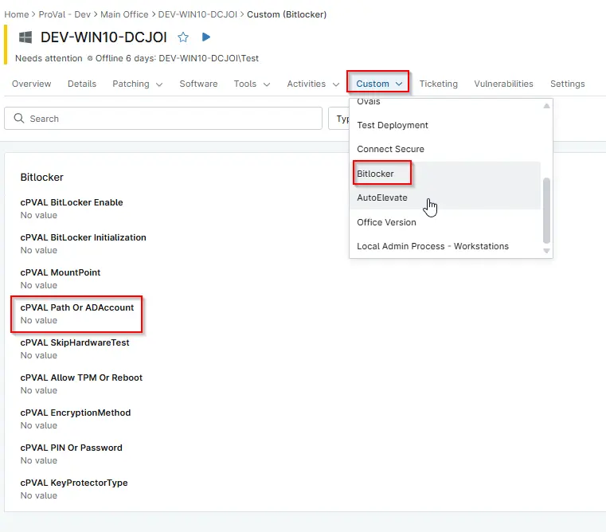

## Summary

Option for specifying the file path or Active Directory account required by certain BitLocker key protector types. Example: `F:\Recovery`, `CONTOSO\ContosoUser`, or `CONTOSO\ContosoGroup`.

## Details

| Label | Field Name | Definition Scope | Type | Required | Example | Technician Permission | Automation Permission | API Permission | Description | Tool Tip | Footer Text |  Custom Field Tab Name |
| ----- | ---- | ---------------- | ---- | -------- | ------------- | --------------------- | --------------------- | -------------- | ----------- | -------- | ----------- | ----------- |
| cPVAL Path Or ADAccount | cpvalPathOrAdaccount | `Organizations`,`Devices`,`Location` | Text | | | Editable | Read_Write | Read_Write | Option for specifying the file path or Active Directory account required by certain BitLocker key protector types. Examples include: `F:\Recovery`, `CONTOSO\ContosoUser`, or `CONTOSO\ContosoGroup`. | Option for specifying the file path or Active Directory account required by certain BitLocker key protector types. | Option for specifying the file path or Active Directory account required by certain BitLocker key protector types. | BitLocker |

## Dependencies

- [Automation - Initialize BitLocker](/docs/e3a24552-f347-4117-82f5-7afaaa3fc198)
- [Solution - BitLocker Initialize - NinjaOne](/docs/2ebfabd5-05cf-4175-a513-2aa290eb26e8)

## Custom Field Creation

[Custom Field Configuration](https://github.com/ProVal-Tech/ninjarmm/blob/main/custom-fields/cpval-Path-Or-Ad-account.toml)

## Sample Screenshot

  
