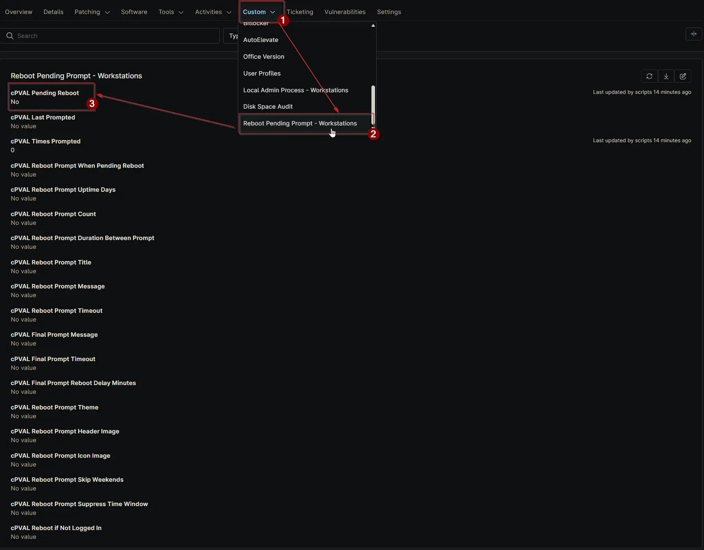

## Summary

Manual checkbox to enable reboot prompts for this device regardless of its current reboot status.

## Details

| Label | Field Name | Definition Scope | Type | Required | Default Value | Technician Permission | Automation Permission | API Permission | Description | Tool Tip | Footer Text | Org Level Tab | Location Level Tab | Device Level Tab |
| ----- | ---- | ---------------- | ---- | -------- | ------------- | --------------------- | --------------------- | -------------- | ----------- | -------- | ----------- | ----------- | ----------- | ----------- | 
| cPVAL Pending Reboot | cpvalPendingReboot | Device | Checkbox | False | | Editable | Read_Write | Read_Write | Manual checkbox to enable reboot prompts for this device regardless of its current reboot status. | Check to force reboot prompts on this machine, even if Windows does not report reboot pending. | Use this option to override all other settings and ensure reboot prompts appear for this device. | | | Reboot Pending Prompt - Workstations |

## Dependencies

- [Solution: Reboot Pending Prompt](/docs/d7758fa4-9fcc-4259-a7a5-0ca65dda10eb)

## Custom Field Creation

- [Custom Field Configuration](https://github.com/ProVal-Tech/ninjarmm/blob/main/custom-fields/cpval-pending-reboot.toml)

## Sample Screenshot

