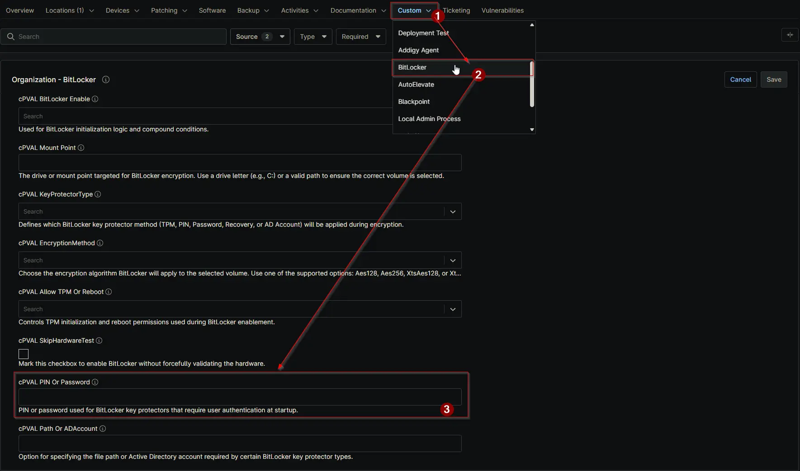

## Summary

Specifies the PIN or password required when using a BitLocker key protector that depends on user-provided authentication. Examples include simple PINs (e.g., 123456) or strong passwords (e.g., Pa$sw0rD! or 123456-654321-…).

## Details

| Label | Field Name | Definition Scope | Type | Required | Technician Permission | Automation Permission | API Permission | Description | Tool Tip | Footer Text | Custom Field Tab Name |
| ----- | ---- | ---------------- | ---- | ------------- | --------------------- | --------------------- | -------------- | ----------- | -------- | ----------- | ----------- |
| cPVAL PIN Or Password | cpvalPinOrPassword | `Organizations`,`Devices`,`Location` | Text | `false` | Editable | Read_Write | Read_Write | Specify the PIN or password required when using a BitLocker key protector that depends on user-provided authentication. | Enter the PIN or password used by BitLocker key protectors that require user authentication. | PIN or password used for BitLocker key protectors that require user authentication at startup. | BitLocker |

## Dependencies

- [Solution - BitLocker Initialize - NinjaOne](/docs/2ebfabd5-05cf-4175-a513-2aa290eb26e8)

## Custom Field Creation

[Custom Field Configuration](https://github.com/ProVal-Tech/ninjarmm/blob/main/custom-fields/cpval-pin-or-password.toml)

## Sample Screenshot

