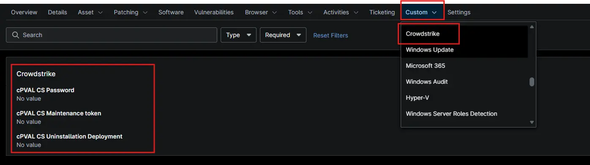

## Summary

Stores the CrowdStrike Falcon Sensor uninstall password used for authenticated sensor removal.

## Details

| Label | Field Name | Example | Definition Scope | Type | Required | Default Value | Dropdown Options | Editable | Custom Field Tab |
| ----- | ---------- | ------- | ---------------- | ---- | -------- | ------------- | ---------------- | -------- | ---------------- |
| cPVAL CS Password | cpvalcspassword | -- | `Device`, `Location`, `Organization` | Text | False | --- | -- |  Yes | Crowdstrike |

## Dependencies

- [Automation - Uninstall CrowdStrike](/docs/3d721829-3986-4700-8eb5-5b1f746d460a)
- [Solution - Uninstall-Crowdstrike-Ninjaone](/docs/96ec2315-d8e2-4793-8db9-8d3f73803945)

## Custom Field Creation

- [Custom Field Configuration](https://github.com/ProVal-Tech/ninjarmm/blob/main/custom-fields/cpval-pspassword.toml)

## Sample Screenshot

## Changelog

### 2026-10-09

Initial version of the script.