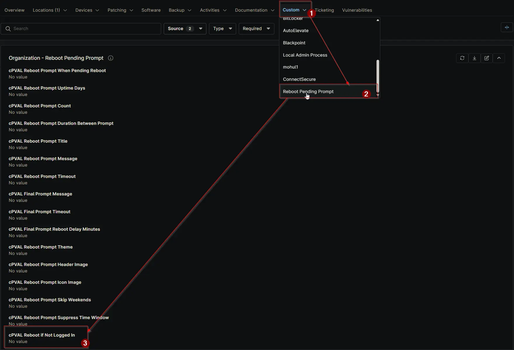

## Summary

Forces a reboot if no user is logged in. Available at Client, Location, or Device level and can be overridden at lower levels.

## Details

| Label | Field Name | Definition Scope | Type | Required | Default Value | Dropdown Options | Technician Permission | Automation Permission | API Permission | Description | Tool Tip | Footer Text | Org Level Tab | Location Level Tab | Device Level Tab |
| ----- | ---- | ---------------- | ---- | -------- | ------------- | ---------------- | --------------------- | --------------------- | -------------- | ----------- | -------- | ----------- | ----------- | ----------- | ----------- |
| cPVAL Reboot if Not Logged In | cpvalRebootIfNotLoggedIn | Organization, Location, Device | Dropdown | False | `False` | Enable, Disable | Editable | Read_Write | Read_Write | Forces a reboot if no user is logged in. Available at Client, Location, or Device level and can be overridden at lower levels. | Enable to restart the computer automatically when no user is logged in. Can be overridden at Location or Device level. | Ensures unattended machines reboot without waiting for user input. Overrides at Location or Device level allow flexibility. | Reboot Pending Prompt | Reboot Pending Prompt | Reboot Pending Prompt - Workstations |

## Dependencies

- [Solution: Reboot Pending Prompt](/docs/d7758fa4-9fcc-4259-a7a5-0ca65dda10eb)

## Custom Field Creation

- [Custom Field Configuration](https://github.com/ProVal-Tech/ninjarmm/blob/main/custom-fields/cpval-reboot-if-not-logged-in.toml)

## Sample Screenshot

