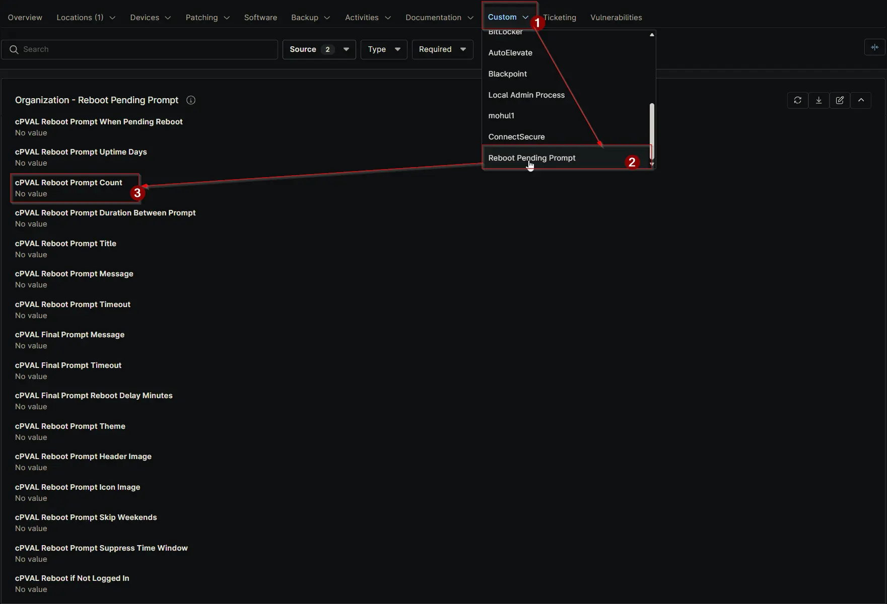

## Summary

Specifies how many times a user will be prompted before being forced to reboot. For example, if set to 4, the reboot becomes mandatory on the 5th prompt. Can be configured or overridden at any level.

## Details

| Label | Field Name | Definition Scope | Type | Required | Default Value | Technician Permission | Automation Permission | API Permission | Description | Tool Tip | Footer Text | Org Level Tab | Location Level Tab | Device Level Tab |
| ----- | ---- | ---------------- | -------- | ------------- | ---------------- | --------------------- | --------------------- | -------------- | ----------- | -------- | ----------- | ----------- | ----------- | ----------- |
| cPVAL Reboot Prompt Count | cpvalRebootPromptCount | Organization, Location, Device | Integer | False | `4` | Editable | Read_Write | Read_Write | Specifies how many times a user will be prompted before being forced to reboot. For example, if set to 4, the reboot becomes mandatory on the 5th prompt. Can be configured or overridden at any level. | Set the number of prompts before forcing a reboot. Example: 4 means forced reboot on the 5th prompt. Can be overridden at the Location or Device level. | Controls reboot enforcement after repeated prompts. Overrides at the Location or Device level allow flexibility. | Reboot Pending Prompt | Reboot Pending Prompt | Reboot Pending Prompt - Workstations |

## Dependencies

- [Solution: Reboot Pending Prompt](/docs/d7758fa4-9fcc-4259-a7a5-0ca65dda10eb)

## Custom Field Creation

- [Custom Field Configuration](https://github.com/ProVal-Tech/ninjarmm/blob/main/custom-fields/cpval-reboot-prompt-count.toml)

## Sample Screenshot

