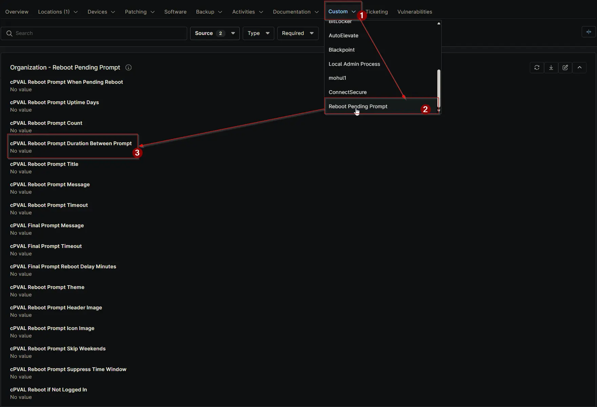

## Summary

Defines the wait time (in hours) between consecutive reboot prompts. Applies at Client, Location, or Device level and can be overridden at lower levels.

## Details

| Label | Field Name | Definition Scope | Type | Required | Default Value | Dropdown Options | Technician Permission | Automation Permission | API Permission | Description | Tool Tip | Footer Text | Org Level Tab | Location Level Tab | Device Level Tab |
| ----- | ---- | ---------------- | ---- | -------- | ------------- | ---------------- | --------------------- | --------------------- | -------------- | ----------- | -------- | ----------- | ----------- | ----------- | ----------- |
| cPVAL Reboot Prompt Duration Between Prompt | cpvalRebootPromptDurationBetweenPrompt | Organization, Location, Device | Integer | False | | | Editable | Read_Write | Read_Write | Defines the wait time (in hours) between consecutive reboot prompts. Applies at Client, Location, or Device level and can be overridden at lower levels. | Set how many hours the monitor waits before showing the next reboot prompt. Can be overridden at the Location or Device level. | Controls the interval between reboot prompts for pending reboots. Overrides at the Location or Device level allow flexibility. | Reboot Pending Prompt | Reboot Pending Prompt | Reboot Pending Prompt - Workstations |

## Dependencies

- [Solution: Reboot Pending Prompt](/docs/d7758fa4-9fcc-4259-a7a5-0ca65dda10eb)

## Custom Field Creation

- [Custom Field Configuration](https://github.com/ProVal-Tech/ninjarmm/blob/main/custom-fields/cpval-reboot-prompt-duration-between-prompt.toml)

## Sample Screenshot

