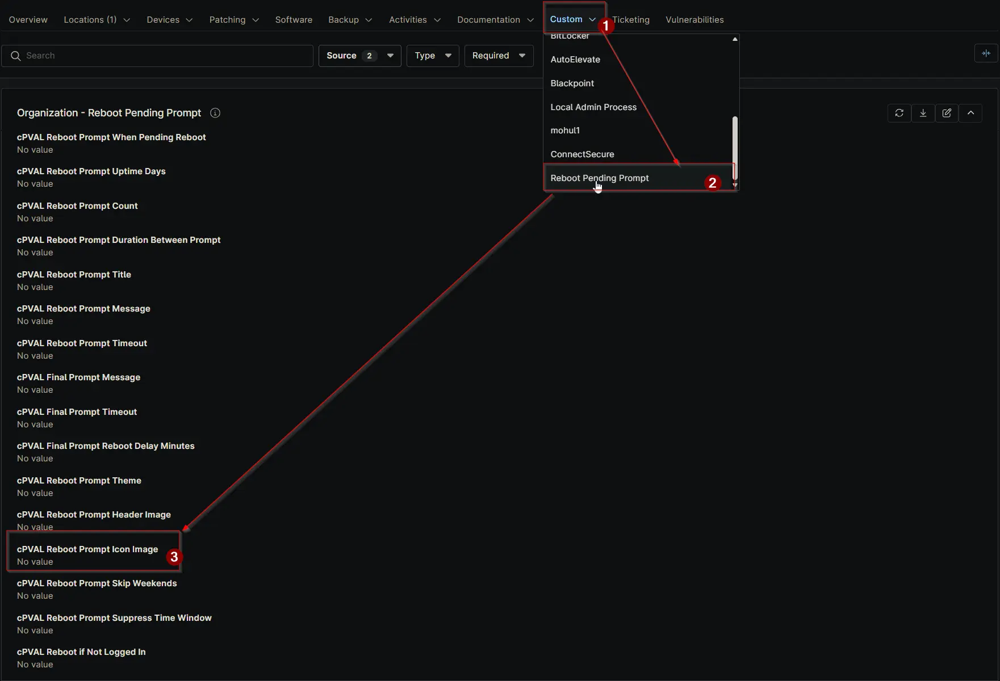

## Summary

Specifies the local file path or URL for the icon image displayed in the reboot prompt. Can be configured or overridden at Client, Location, or Device level.

## Details

| Label | Field Name | Definition Scope | Type | Required | Default Value | Technician Permission | Automation Permission | API Permission | Description | Tool Tip | Footer Text | Org Level Tab | Location Level Tab | Device Level Tab |
| ----- | ---- | ---------------- |  -------- | ------------- | ---------------- | --------------------- | --------------------- | -------------- | ----------- | -------- | ----------- | ----------- | ----------- | ----------- |
| cPVAL Reboot Prompt Icon Image | cpvalRebootPromptIconImage | Organization, Location, Device | Text | False |  | Editable | Read_Write | Read_Write | Specifies the local file path or URL for the icon image displayed in the reboot prompt. Can be configured or overridden at Client, Location, or Device level. | Provide a local path or URL for the icon image in the reboot prompt. Can be overridden at Location or Device level. | Customize the reboot prompt with an icon image for better branding. Overrides at Location or Device level allow flexibility. | Reboot Pending Prompt | Reboot Pending Prompt | Reboot Pending Prompt - Workstations |

## Dependencies

- [Solution: Reboot Pending Prompt](/docs/d7758fa4-9fcc-4259-a7a5-0ca65dda10eb)

## Custom Field Creation

- [Custom Field Configuration](https://github.com/ProVal-Tech/ninjarmm/blob/main/custom-fields/cpval-reboot-prompt-icon-image.toml)

## Sample Screenshot

