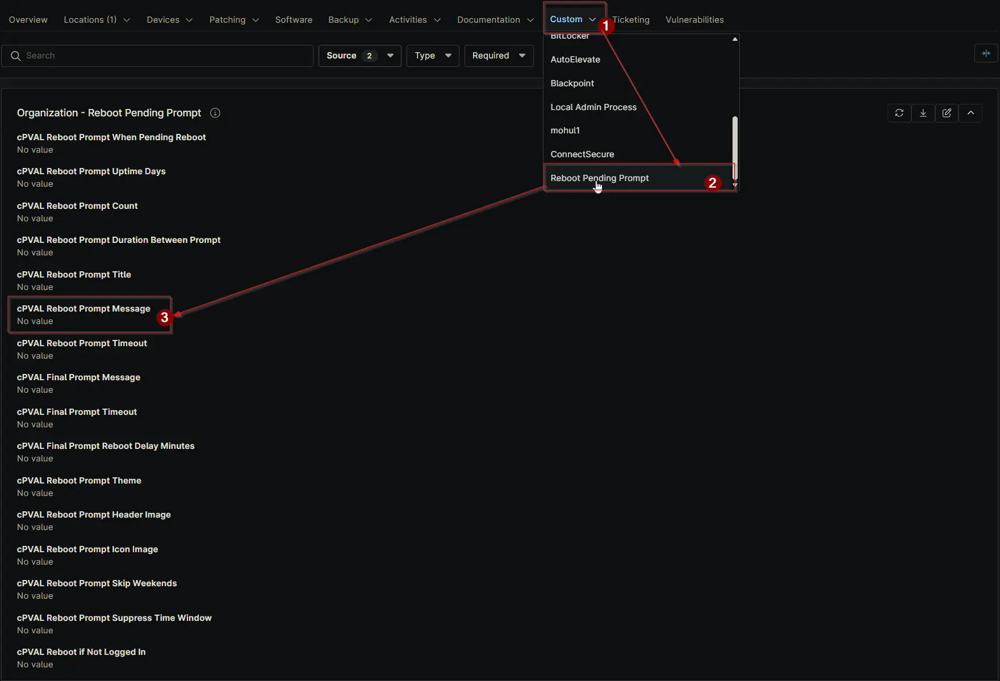

## Summary

Sets the custom message displayed to users when prompting for a reboot. Keep it short; “Would you like to restart now? You have `{X}` prompt(s) remaining before a forced reboot.” will be added automatically. Can be configured or overridden at any level. Avoid using single quotation marks (') in the message. Use regular quotes (") if needed.

## Details

| Label | Field Name | Definition Scope | Type | Required | Default Value | Dropdown Options | Technician Permission | Automation Permission | API Permission | Description | Tool Tip | Footer Text | Org Level Tab | Location Level Tab | Device Level Tab |
| ----- | ---- | ---------------- | ---- | -------- | ------------- | ---------------- | --------------------- | --------------------- | -------------- | ----------- | -------- | ----------- | ----------- | ----------- | ----------- |
| cPVAL Reboot Prompt Message | cpvalRebootPromptMessage | Organization, Location, Device | Text | False | | | Editable | Read_Write | Read_Write | Sets the custom message displayed to users when prompting for a reboot. Keep it short; “Would you like to restart now? You have `{X}` prompt(s) remaining before a forced reboot.” will be added automatically. Can be configured or overridden at any level. Avoid using single quotation marks (') in the message. | Enter a brief message shown before “Would you like to restart now? You have `{X}` prompt(s) remaining before a forced reboot.”. Applies globally but can be overridden at the Location or Device level. Avoid using single quotation marks (') in the message. Use regular quotes (") if needed. | Customize the reboot prompt message for better user communication. Overrides at the Location or Device level allow flexibility. Avoid using single quotation marks (') in the message. Use regular quotes (") if needed.| Reboot Pending Prompt | Reboot Pending Prompt | Reboot Pending Prompt - Workstations |

## Dependencies

- [Solution: Reboot Pending Prompt](/docs/d7758fa4-9fcc-4259-a7a5-0ca65dda10eb)

## Custom Field Creation

- [Custom Field Configuration](https://github.com/ProVal-Tech/ninjarmm/blob/main/custom-fields/cpval-reboot-prompt-message.toml)

## Sample Screenshot

