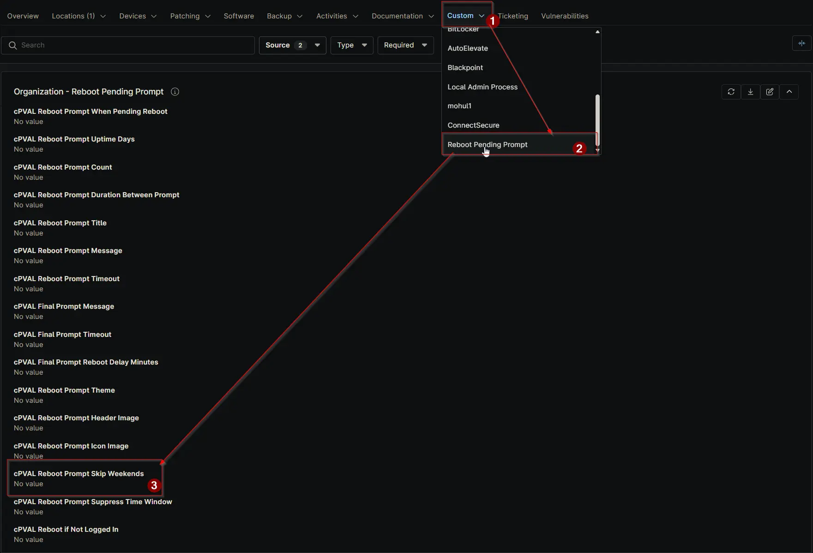

## Summary

Controls whether reboot prompts are skipped on weekends. Options: Enable or Disable. Default is Disable if not set. Can be configured or overridden at Client, Location, or Device level.

## Details

| Label | Field Name | Definition Scope | Type | Required | Default Value | Dropdown Options | Technician Permission | Automation Permission | API Permission | Description | Tool Tip | Footer Text | Org Level Tab | Location Level Tab | Device Level Tab |
| ----- | ---- | ---------------- | ---- | -------- | ------------- | ---------------- | --------------------- | --------------------- | -------------- | ----------- | -------- | ----------- | ----------- | ----------- | ----------- |
| cPVAL Reboot Prompt Skip Weekends | cpvalRebootPromptSkipWeekends | Organization, Location, Device | Dropdown | False | | Enable, Disable | Editable | Read_Write | Read_Write | Controls whether reboot prompts are skipped on weekends. Options: Enable or Disable. Default is Disable if not set. Can be configured or overridden at Client, Location, or Device level. | Enable to skip reboot prompts on weekends. Disable to allow prompts every day. Can be overridden at Location or Device level. | Use this setting to avoid reboot prompts on weekends. Overrides at Location or Device level allow flexibility. | Reboot Pending Prompt | Reboot Pending Prompt | Reboot Pending Prompt - Workstations |

## Dependencies

- [Solution: Reboot Pending Prompt](/docs/d7758fa4-9fcc-4259-a7a5-0ca65dda10eb)

## Custom Field Creation

- [Custom Field Configuration](https://github.com/ProVal-Tech/ninjarmm/blob/main/custom-fields/cpval-reboot-prompt-skip-weekends.toml)

## Sample Screenshot

