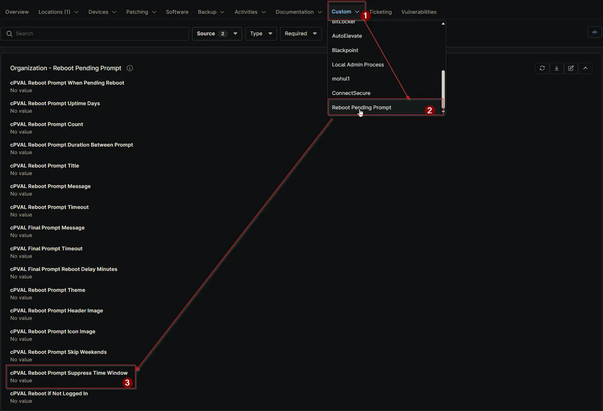

## Summary

Specify time ranges to suppress reboot prompts. Example: 1800-0900 means no prompts between 6:00 PM and 9:00 AM. Can be configured or overridden at Client, Location, or Device level.

## Details

| Label | Field Name | Definition Scope | Type | Required | Default Value |  Technician Permission | Automation Permission | API Permission | Description | Tool Tip | Footer Text | Org Level Tab | Location Level Tab | Device Level Tab |
| ----- | ---- | ---------------- | -------- | ------------- | ---------------- | --------------------- | --------------------- | -------------- | ----------- | -------- | ----------- | ----------- | ----------- | ----------- |
| cPVAL Reboot Prompt Suppress Time Window | cpvalRebootPromptSuppressTimeWindow | Organization, Location, Device | Text | False |  | Editable | Read_Write | Read_Write | Specify time ranges to suppress reboot prompts. Example: 1800-0900 means no prompts between 6:00 PM and 9:00 AM. Can be configured or overridden at Client, Location, or Device level. | Enter time window (HHMM-HHMM) to block prompts. Example: 1800-0900 skips prompts from 6 PM to 9 AM. Can be overridden at the Location or Device level. | Use this setting to avoid reboot prompts during specified hours. Overrides at the Location or Device level allow flexibility. | Reboot Pending Prompt | Reboot Pending Prompt | Reboot Pending Prompt - Workstations |

## Dependencies

- [Solution: Reboot Pending Prompt](/docs/d7758fa4-9fcc-4259-a7a5-0ca65dda10eb)

## Custom Field Creation

- [Custom Field Configuration](https://github.com/ProVal-Tech/ninjarmm/blob/main/custom-fields/cpval-reboot-prompt-suppress-time-window.toml)

## Sample Screenshot

