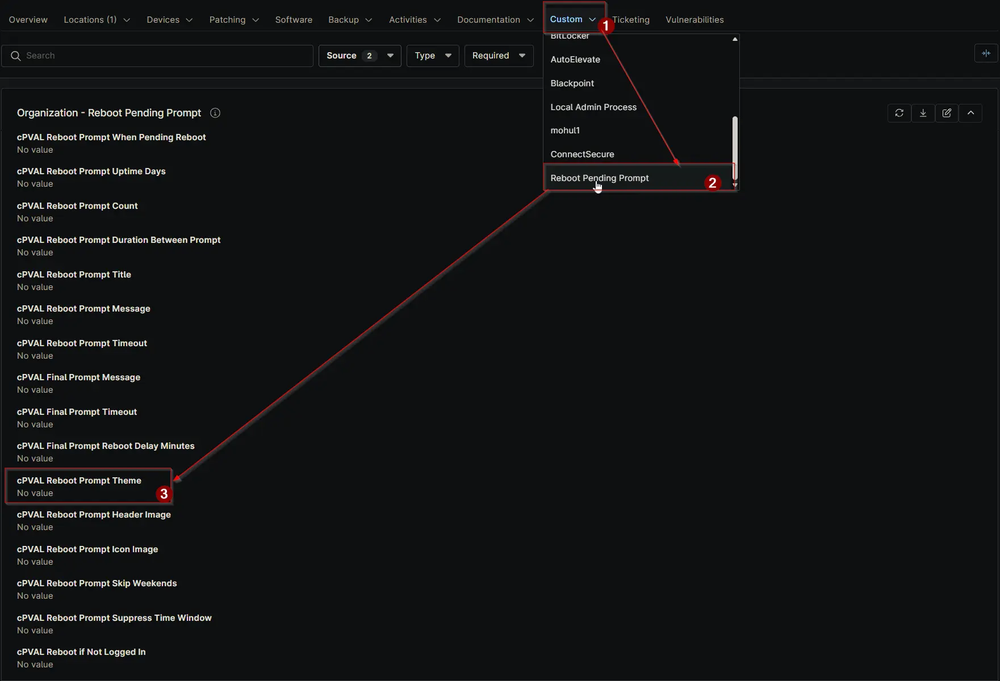

## Summary

Select the theme for the reboot prompt, options: Dark or Light. Default is Dark if not set. Can be configured or overridden at the Client, Location, or Device level.

## Details

| Label | Field Name | Definition Scope | Type | Required | Default Value | Dropdown Options | Technician Permission | Automation Permission | API Permission | Description | Tool Tip | Footer Text | Org Level Tab | Location Level Tab | Device Level Tab |
| ----- | ---- | ---------------- | ---- | -------- | ------------- | ---------------- | --------------------- | --------------------- | -------------- | ----------- | -------- | ----------- | ----------- | ----------- | ----------- |
| cPVAL Reboot Prompt Theme | cpvalRebootPromptTheme | Organization, Location, Device | Dropdown | False | | Enable, Disable | Editable | Read_Write | Read_Write | Select the theme for the reboot prompt, options: Dark or Light. Default is Dark if not set. Can be configured or overridden at the Client, Location, or Device level. | Choose between Dark and Light themes for the reboot prompt. Default is Dark. Can be overridden at the Location or Device level. | Customize the reboot prompt appearance with Dark or Light theme. Overrides at the Location or Device level allow flexibility. | Reboot Pending Prompt | Reboot Pending Prompt | Reboot Pending Prompt - Workstations |

## Dependencies

- [Solution: Reboot Pending Prompt](/docs/d7758fa4-9fcc-4259-a7a5-0ca65dda10eb)

## Custom Field Creation

- [Custom Field Configuration](https://github.com/ProVal-Tech/ninjarmm/blob/main/custom-fields/cpval-reboot-prompt-theme.toml)

## Sample Screenshot

