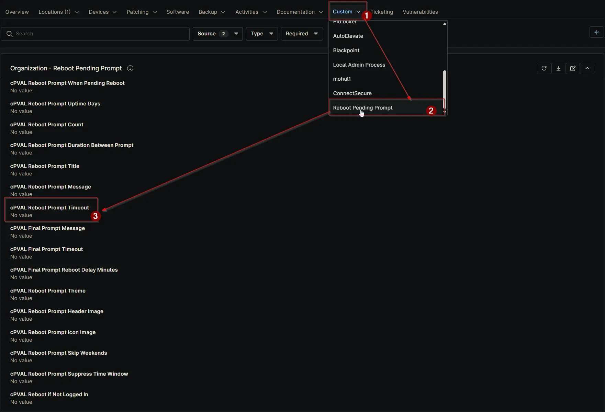

## Summary

Sets how long (in seconds) the reboot prompt stays visible on the end machine. Default is 300 seconds (5 minutes). Can be configured or overridden at Client, Location, or Device level.

## Details

| Label | Field Name | Definition Scope | Type | Required | Default Value | Dropdown Options | Technician Permission | Automation Permission | API Permission | Description | Tool Tip | Footer Text | Org Level Tab | Location Level Tab | Device Level Tab |
| ----- | ---- | ---------------- | ---- | -------- | ------------- | ---------------- | --------------------- | --------------------- | -------------- | ----------- | -------- | ----------- | ----------- | ----------- | ----------- |
| cPVAL Reboot Prompt Timeout | cpvalRebootPromptTimeout | Organization, Location, Device | Integer | False | | | Editable | Read_Write | Read_Write | Sets how long (in seconds) the reboot prompt stays visible on the end machine. Default is 300 seconds (5 minutes). Can be configured or overridden at Client, Location, or Device level. | Enter timeout in seconds for the reboot prompt. Default is 300 (5 minutes). Can be overridden at Location or Device level. | Controls how long the reboot prompt remains active before closing. Overrides at Location or Device level allow flexibility. | Reboot Pending Prompt | Reboot Pending Prompt | Reboot Pending Prompt - Workstations |

## Dependencies

- [Solution: Reboot Pending Prompt](/docs/d7758fa4-9fcc-4259-a7a5-0ca65dda10eb)

## Custom Field Creation

- [Custom Field Configuration](https://github.com/ProVal-Tech/ninjarmm/blob/main/custom-fields/cpval-reboot-prompt-timeout.toml)

## Sample Screenshot

