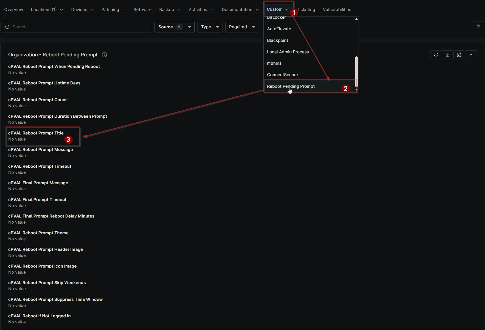

## Summary

Sets the title for the reboot prompt. If left blank, the default title `Updates Installed - Reboot Required` will be used. Can be configured or overridden at Client, Location, or Device level.

## Details

| Label | Field Name | Definition Scope | Type | Required | Default Value | Technician Permission | Automation Permission | API Permission | Description | Tool Tip | Footer Text | Org Level Tab | Location Level Tab | Device Level Tab |
| ----- | ---- | ---------------- | ---- | -------- | ------------- |  --------------------- | --------------------- | -------------- | ----------- | -------- | ----------- | ----------- | ----------- | ----------- |
| cPVAL Reboot Prompt Title | cpvalRebootPromptTitle | Organization, Location, Device | Text | False | | Editable | Read_Write | Read_Write | Sets the title for the reboot prompt. If left blank, the default title “Updates Installed - Reboot Required” will be used. Can be configured or overridden at Client, Location, or Device level. | Enter a custom title for the reboot prompt. Leave blank to use the default: “Updates Installed - Reboot Required.” Can be overridden at Location or Device level. | Customize the prompt title for better clarity. If blank, the default title applies. Overrides at Location or Device level allow flexibility. | Reboot Pending Prompt | Reboot Pending Prompt | Reboot Pending Prompt - Workstations |

## Dependencies

- [Solution: Reboot Pending Prompt](/docs/d7758fa4-9fcc-4259-a7a5-0ca65dda10eb)

## Custom Field Creation

- [Custom Field Configuration](https://github.com/ProVal-Tech/ninjarmm/blob/main/custom-fields/cpval-reboot-prompt-title.toml)

## Sample Screenshot

