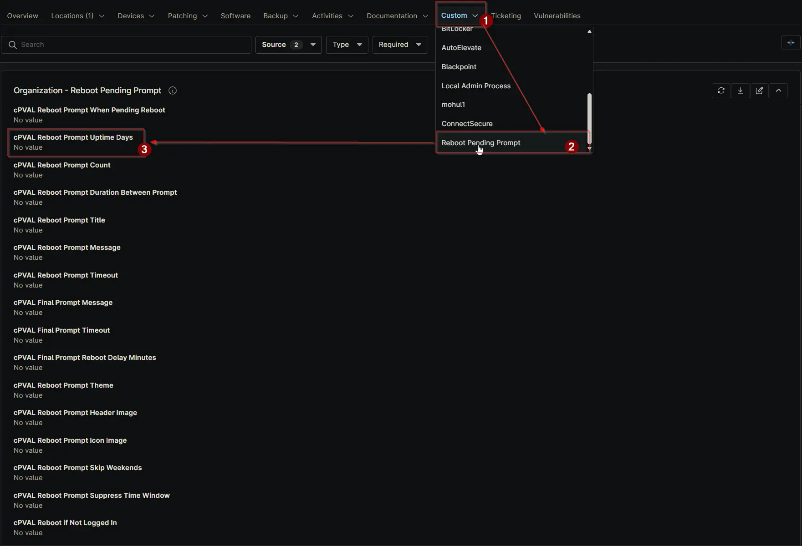

## Summary

Defines the number of uptime days that must pass before prompting for a reboot on Windows machines. Setting to 0 disables this feature. Can be configured or overridden at Client, Location, or Device level.

## Details

| Label | Field Name | Definition Scope | Type | Required | Default Value | Technician Permission | Automation Permission | API Permission | Description | Tool Tip | Footer Text | Org Level Tab | Location Level Tab | Device Level Tab |
| ----- | ---- | ---------------- | -------- | ------------- | ---------------- | --------------------- | --------------------- | -------------- | ----------- | -------- | ----------- | ----------- | ----------- | ----------- |
| cPVAL Reboot Prompt Uptime Days | cpvalRebootPromptUptimeDays | Organization, Location, Device | Integer | False | `0` | Editable | Read_Write | Read_Write | Defines the number of uptime days that must pass before prompting for a reboot on Windows machines. Setting to `0` disables this feature. Can be configured or overridden at Client, Location, or Device level. | Specify the uptime days before triggering a reboot prompt. Use 0 to disable. Applies globally but can be overridden at the Location or Device level. | Helps automate reboot prompts based on machine uptime. Overrides at the Location or Device level allow flexibility. | Reboot Pending Prompt | Reboot Pending Prompt | Reboot Pending Prompt - Workstations |

## Dependencies

- [Solution: Reboot Pending Prompt](/docs/d7758fa4-9fcc-4259-a7a5-0ca65dda10eb)

## Custom Field Creation

- [Custom Field Configuration](https://github.com/ProVal-Tech/ninjarmm/blob/main/custom-fields/cpval-reboot-prompt-uptime-days.toml)

## Sample Screenshot

