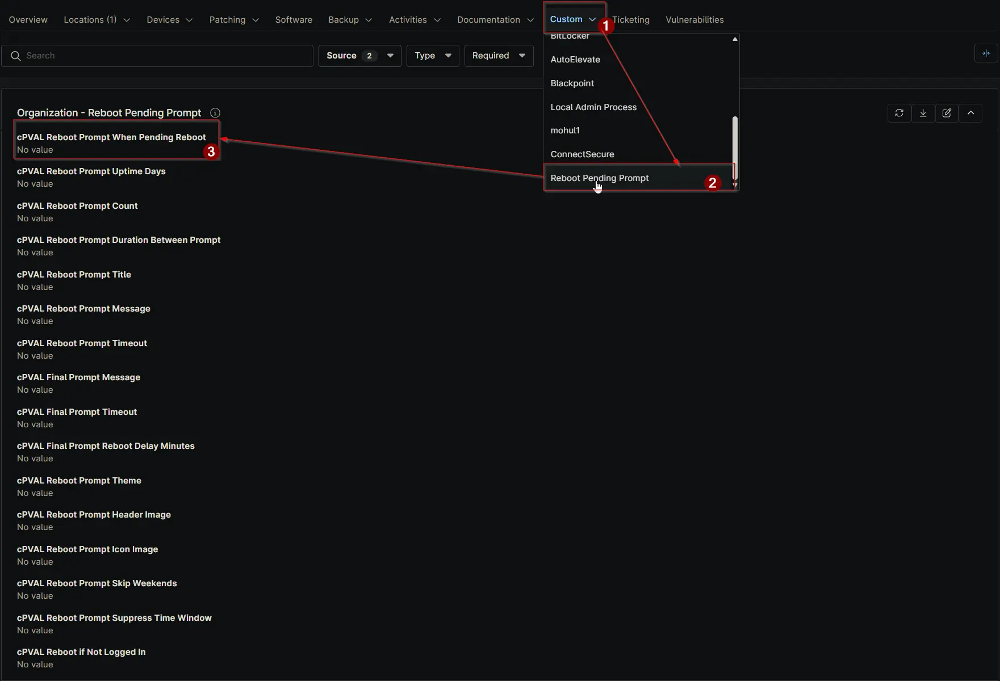

## Summary

Controls whether a prompt appears on Windows machines with reboot pending status. Applies at Client, Location, or Device level and can be overridden at lower levels.

## Details

| Label | Field Name | Definition Scope | Type | Required | Default Value | Dropdown Options | Technician Permission | Automation Permission | API Permission | Description | Tool Tip | Footer Text | Org Level Tab | Location Level Tab | Device Level Tab |
| ----- | ---- | ---------------- | ---- | -------- | ------------- | ---------------- | --------------------- | --------------------- | -------------- | ----------- | -------- | ----------- | ----------- | ----------- | ----------- |
| cPVAL Reboot Prompt When Pending Reboot | cpvalRebootPromptWhenPendingReboot | Organization, Location, Device | Dropdown | False | `Disable` | `Enable`, `Disable` | Editable | Read_Write | Read_Write | Controls whether a prompt appears on Windows machines with reboot pending status. Applies at Client, Location, or Device level and can be overridden at lower levels. | Enable to show prompts when Windows reports reboot pending. Disable to suppress them. Can be set globally or overridden at Location/Device level. | Ensures users are notified when a reboot is pending. Overrides apply at Location or Device level for flexibility. | Reboot Pending Prompt | Reboot Pending Prompt | Reboot Pending Prompt - Workstations |

## Dependencies

- [Solution: Reboot Pending Prompt](/docs/d7758fa4-9fcc-4259-a7a5-0ca65dda10eb)

## Custom Field Creation

- [Custom Field Configuration](https://github.com/ProVal-Tech/ninjarmm/blob/main/custom-fields/cpval-reboot-prompt-when-pending-reboot.toml)

## Sample Screenshot

