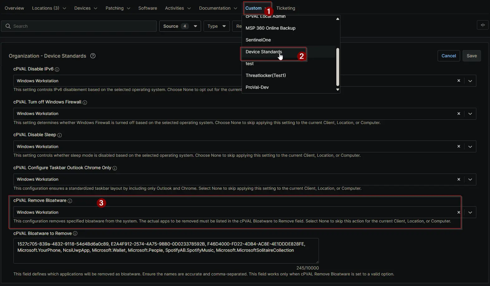

## Summary

This custom field removes specified bloatware from the system. The actual apps to be removed must be listed in the [cPVAL Bloatware to Remove](/docs/) field. Select None to skip this action for the current Client, Location, or Computer.

## Details

| Label | Field Name | Definition Scope | Type | Required | Default Value | Available Options | Technician Permission | Automation Permission | API Permission | Description | Tool Tip | Footer Text | Custom Field Tab Name |
| ----- | ---- | ---------------- | ---- | -------- | ------------- | --------------------- | --------------------- | -------------- | ----------- | -------- | ----------- | ----------- | ----------- |
| cPVAL Remove Bloatware | cpvalRemoveBloatware | `Organization`, `Location`, `Device` | Drop-down | False | | `None`, `Windows Workstation and Windows Server`, `Windows Workstation`, `Windows Server` | Editable | Read_Write | Read_Write | Enable this setting to remove unwanted applications (bloatware) from the system. The list of applications to be removed must be specified in the cPVAL Bloatware to Remove field as a comma-separated list. | Activates bloatware removal based on the list provided in the cPVAL Bloatware to Remove field. Ensure the list is comma-separated and accurate. | This configuration removes specified bloatware from the system. The actual apps to be removed must be listed in the cPVAL Bloatware to Remove field. Select None to skip this action for the current Client, Location, or Computer. | Device Standards |

## Dependencies

- [Custom Field - cPVAL Bloatware to Remove](/docs/b3a55fe5-d7aa-4976-bf57-c46799ef4548)
- [Solution - Remove Bloatware](/docs/)
- [Solution - Device Standards](/docs/)

## Custom Field Creation

[Custom Field Configuration](https://github.com/ProVal-Tech/ninjarmm/blob/main/custom-fields/cpval-remove-bloatware.toml)

## Sample Screenshot

