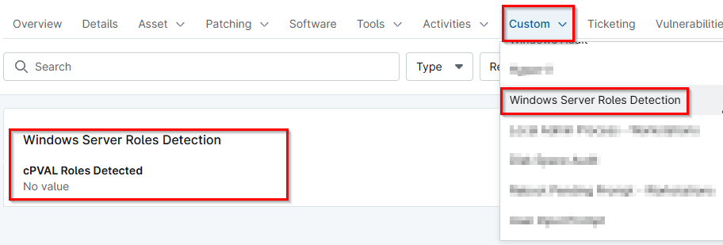

## Summary

This custom field stores the list of roles detected on a Windows server.

## Details

| Label | Field Name | Definition Scope | Type | Required | Technician Permission | Automation Permission | API Permission | Description | Tool Tip | Footer Text |
| ----- | ---------- | ---------------- | ---- | -------- |  --------------------- | --------------------- | -------------- | ----------- | -------- | ----------- |
| cPVAL Roles Detected | cpvalRolesDetected | Device | Multi-line | No | Editable | Read/Write | Read/Write | This custom field stores the list of roles detected on a Windows machine. | Stores the list of roles detected on the computer. | Detected Roles |

## Dependencies

- [Windows Server Roles Detection](/docs/5cda8c79-bcd0-4226-b5a4-db846b9b35a9)
- [Solution - Server Roles Detection and Grouping for NinjaOne](/docs/56ed4b40-11ce-4f8d-b1ca-c897d2c496e6)

## Custom Field Creation

- [Custom Field Configuration](https://github.com/ProVal-Tech/ninjarmm/blob/main/custom-fields/cpval-roles-detected.toml)

## Sample Screenshot

## Changelog

### 2026-05-12

- Created the toml file that was missing and updated the document.

### 2025-03-28

- Initial version of the document
