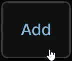
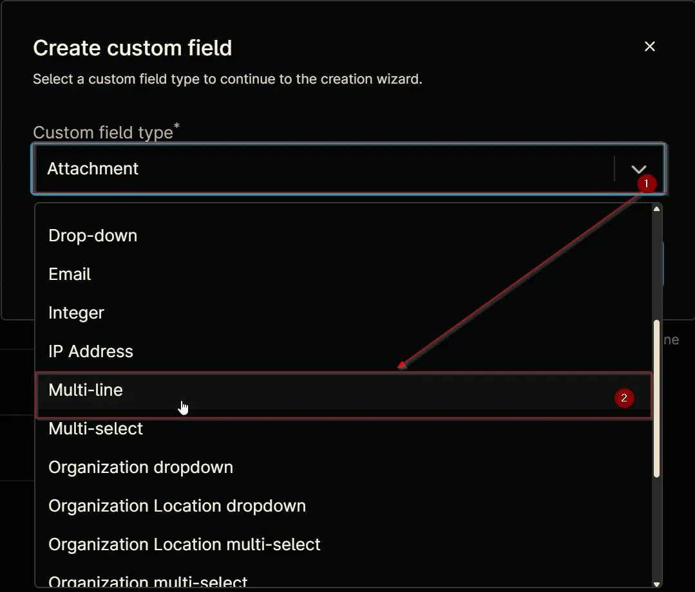
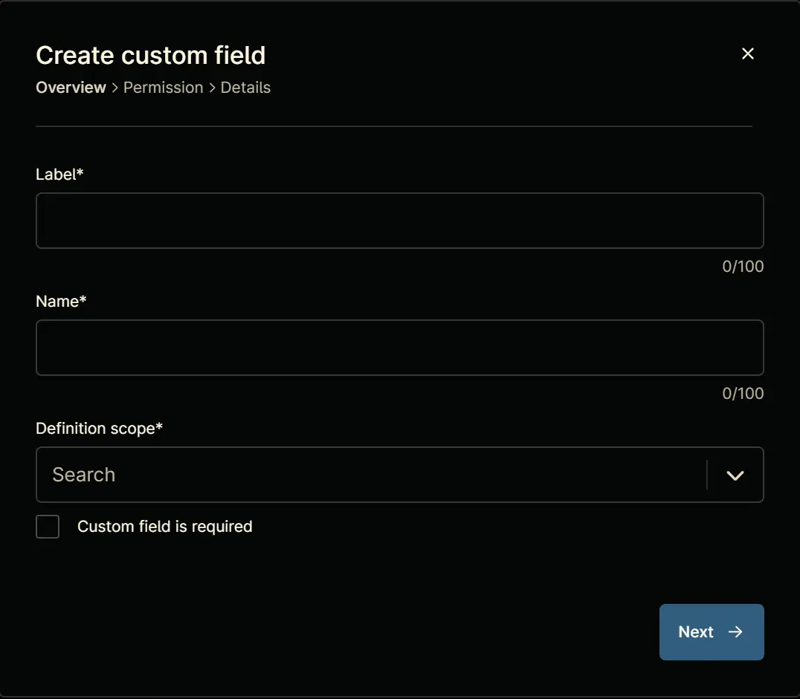
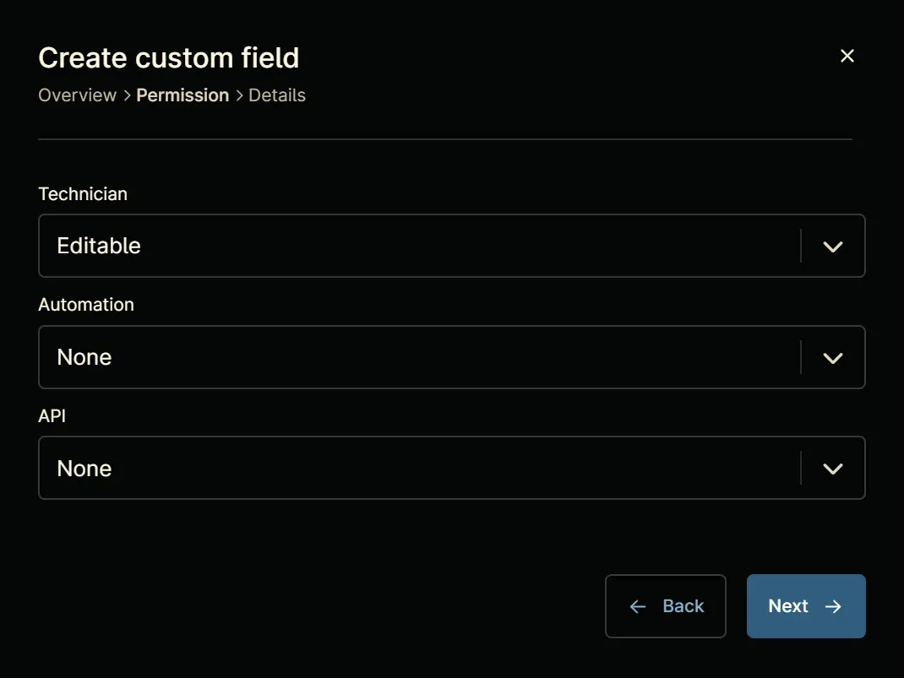
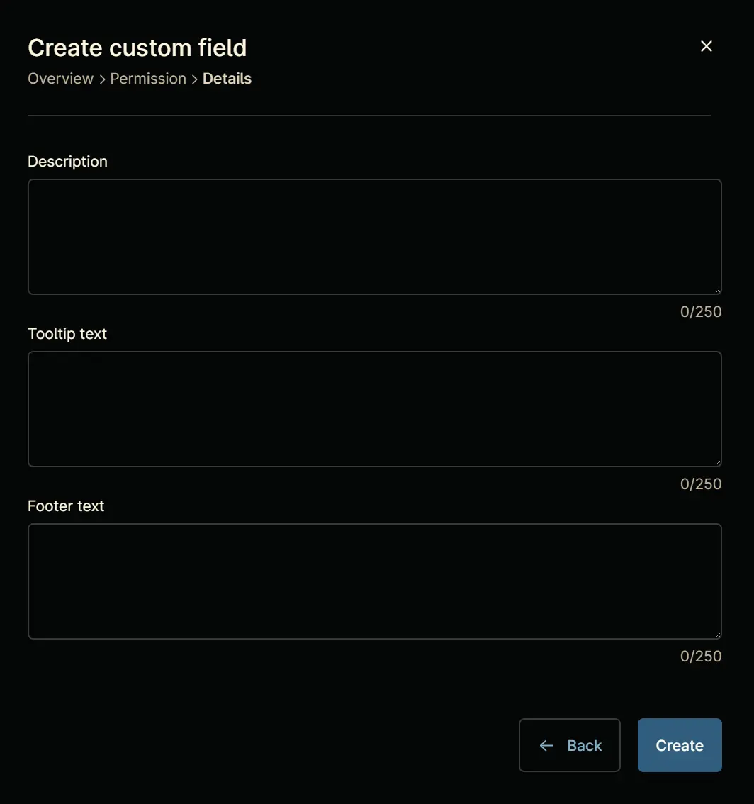
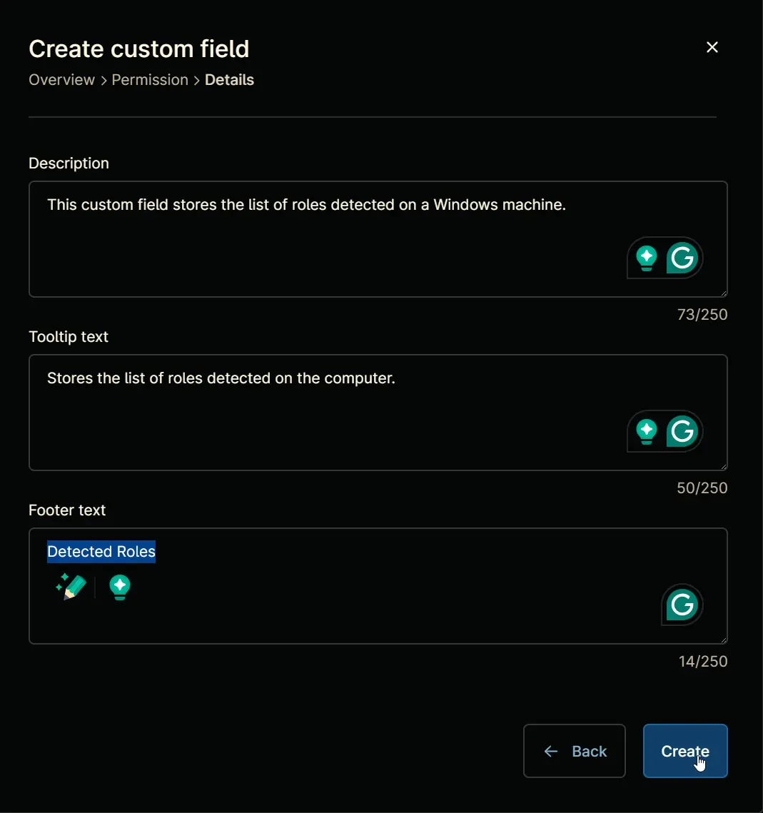
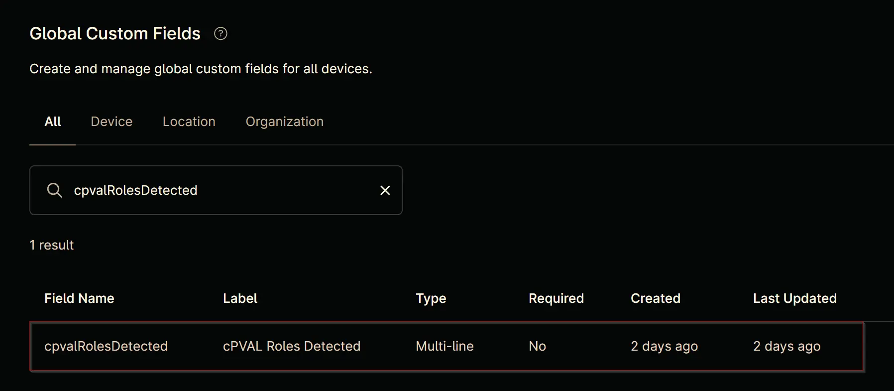

## Summary

This custom field stores the list of roles detected on a Windows server.

## Details

| Label | Field Name | Definition Scope | Type | Required | Technician Permission | Automation Permission | API Permission | Description | Tool Tip | Footer Text |
| ----- | ---------- | ---------------- | ---- | -------- |  --------------------- | --------------------- | -------------- | ----------- | -------- | ----------- |
| cPVAL Roles Detected | cpvalRolesDetected | Device | Multi-line | No | Editable | Read/Write | Read/Write | This custom field stores the list of roles detected on a Windows machine. | Stores the list of roles detected on the computer. | Detected Roles |

## Dependencies

- [Windows Server Roles Detection](/docs/5cda8c79-bcd0-4226-b5a4-db846b9b35a9)
- [Solution - Server Roles Detection and Grouping for NinjaOne](/docs/56ed4b40-11ce-4f8d-b1ca-c897d2c496e6)

## Custom Field Creation

### Step 1

Navigate to the `Administration` menu, then proceed to `Devices` and select `Global Custom Fields`.  

### Step 2

Locate the `Add` button on the right-hand side of the screen and click on it.  
  

### Step 3

After clicking the `Add` button, select the `Field` button that appears.  

The following Pop-up screen will appear:  

### Step 4

Select the `Multi-line` custom field type from the dropdown menu.  

Click the `Continue` button to continue with the custom field creation.  

The following Pop-up screen will appear:  

### Step 5

Set the following details in the `Overview` section and click the `Next` button.  

- **Label:** `cPVAL Roles Detected`  
- **Name:** `cpvalRolesDetected`  
- **Definition Scope:** `Device`  
- **Custom field is required:** `<Leave it unchecked>`

The following Pop-up screen will appear:  

### Step 6

Set the following details in the `Permission` section and click the `Next` button.  

- **Technician:** `Editable`  
- **Automation:** `Read/Write`  
- **API:** `Read/Write`

The following Pop-up screen will appear:  

### Step 7

Set the following details in the `Details` section and click the `Create` button to complete the creation of custom field.

- **Description:** `This custom field stores the list of roles detected on a Windows machine.`  
- **Tooltip text:** `Stores the list of roles detected on the computer.`  
- **Footer text:** `Detected Roles`

## Completed Custom Field

## Example

