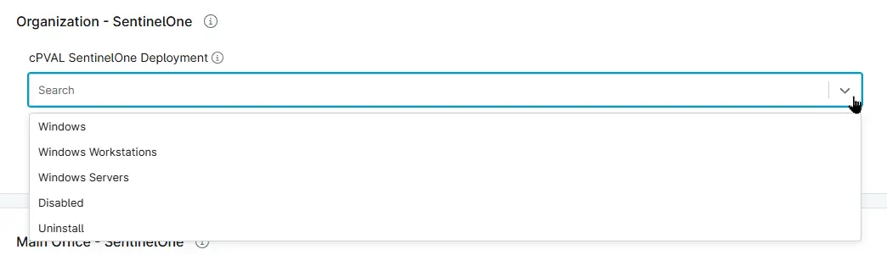

## Summary

This assists with performing the SentinelOne deployment/uninstallation based on the selected option.

## Details

| Label | Field Name | Definition Scope | Type | Option Value | Required | Default Value | Technician Permission | Automation Permission | API Permission | Description | Tool Tip | Footer Text | Custom Field Tab Name |
| ----- | ---- | ---------------- | ---- | -------- | ------------- | --------------------- | --------------------- | -------------- | ----------- | -------- | ----------- |----------- | ---- | 
| cPVAL SentinelOne Deployment | cpvalSentineloneDeployment | `Organization`, `Location`, `Device` | DropDown | `Windows`, `Windows Workstations`, `Windows Servers`,`Disabled`,`Uninstall` | True | - | Editable | Read/Write | Read/Write | Choose the operating system to enable SentinelOne Auto deployment on respective OS. Select Uninstall for Uninstallation if its already installed. | Choose the operating system to enable SentinelOne Auto deployment on respective OS. Select Uninstall for Uninstallation if its already installed. | - | SentinelOne |

## Dependencies

- [Solution - SentinelOne Automation](/docs/0e01e6d8-e332-4a72-aa56-e2386b214ab0)

## Custom Field Creation

[Custom Field Configuration](https://github.com/ProVal-Tech/ninjarmm/blob/main/custom-fields/cpval-sentinelone-deployment.toml)

## Sample Screenshot

## Changelog

### 2026-06-03

- Initial version of the document
