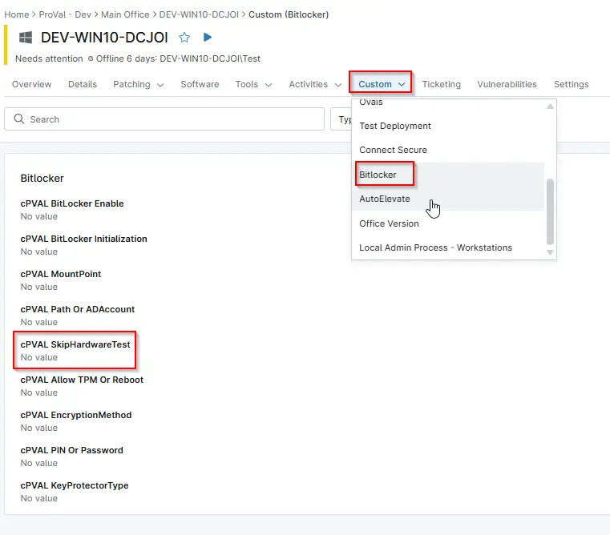

## Summary

Mark this checkbox to enable BitLocker without performing the hardware validation test. Skipping the hardware test allows BitLocker initialization to proceed on devices where hardware checks may fail or are unnecessary.

## Details

| Label | Field Name | Definition Scope | Type | Required | Default Value | Technician Permission | Automation Permission | API Permission | Description | Tool Tip | Footer Text |  Custom Field Tab Name |
| ----- | ---- | ---------------- | ---- | -------- | ------------- | --------------------- | --------------------- | -------------- | ----------- | -------- | ----------- | ----------- |
| cPVAL SkipHardwareTest | cpvalSkiphardwaretest | `Organizations`,`Devices`,`Location` | CheckBox |  |  | Editable | Read_Write | Read_Write | Mark this checkbox to enable BitLocker without performing the hardware validation test. Skipping the hardware test allows BitLocker initialization to proceed on devices where hardware checks may fail or are unnecessary. | Mark this checkbox to enable BitLocker without forcefully validating the hardware. Skipping the hardware test allows BitLocker initialization to proceed on devices where hardware checks may fail or are unnecessary.| Mark this checkbox to enable BitLocker without forcefully validating the hardware. | BitLocker |

## Dependencies

- [Automation - Initialize BitLocker](/docs/e3a24552-f347-4117-82f5-7afaaa3fc198)
- [Solution - Bitlocker Initialize - NinjaOne](/docs/2ebfabd5-05cf-4175-a513-2aa290eb26e8)

## Custom Field Creation

[Custom Field Configuration](https://github.com/ProVal-Tech/ninjarmm/blob/main/custom-fields/cpval-skip-hardware-test.toml)

## Sample Screenshot

  
