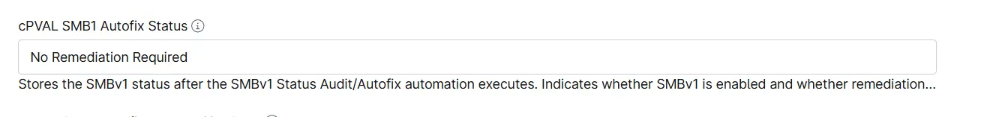

## Summary
Stores the SMBv1 status after the [Automation - SMBv1 Status Audit/Autofix](/docs/1d1540ab-ec63-41d6-99e2-1f8fae44fff0) executes. Indicates whether SMBv1 is enabled and whether remediation is required.

## Details

| Label | Field Name | Example | Definition Scope | Type | Required | Default Value |  Editable | Custom Field Tab |
| ----- | ---------- | ------- | ---------------- | ---- | -------- | ---------------- | -------- | ---------------- |
| cPVAL SMB1 Autofix Status | cpvalsmb1AutofixStatus |  | `System`,`Device` | Text | False | | True | SMB1 Audit/Autofix |

## Dependencies

- [Automation - SMBv1 Status Audit/Autofix](/docs/1d1540ab-ec63-41d6-99e2-1f8fae44fff0)
- [Solution - SMBv1 Status Audit/Autofix](/docs/d4508b91-c43e-41ca-bc94-28a4a22508d8) 

## Custom Field Creation

- [Custom Field Configuration](https://github.com/ProVal-Tech/ninjarmm/blob/main/custom-fields/cpval-smb1-autofix-status.toml)

## Sample Screenshot

## Changelog

### 2026-10-07

- Initial version of the document
