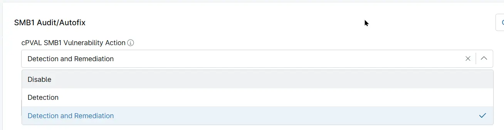

## Summary
Custom Field to choose the SMB1 Vulnerability action to perform on the machine. Detection reports the current SMBv1 state without making any changes. Detection and Remediation disables SMBv1 and then reports the resulting state.

## Details

| Label | Field Name | Example | Definition Scope | Type | Required | Default Value | Dropdown Options | Editable | Custom Field Tab |
| ----- | ---------- | ------- | ---------------- | ---- | -------- | ------------- | ---------------- | -------- | ---------------- |
| cPVAL SMB1 Vulnerability Action | cpvalSmb1VulnerabilityAction | `System`,`Organization`, `Location`, `Device` | Drop-down | False | | <ul><li>Disable</li><li>Detection</li><li>Detection and Remediation</li></ul> | Editable | Read_Write | Read_Write | SMB1 Audit/Autofix |

## Dependencies

- [Solution - SMBv1 Status Audit/Autofix](/docs/d4508b91-c43e-41ca-bc94-28a4a22508d8) 

## Custom Field Creation

- [Custom Field Configuration](https://github.com/ProVal-Tech/ninjarmm/blob/main/custom-fields/cpval-smb1-vulnerability-action.toml)

## Sample Screenshot

## Changelog

### 2026-10-07

- Initial version of the document
