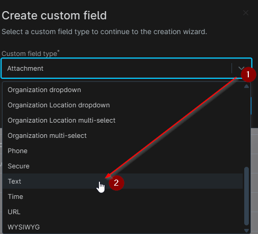
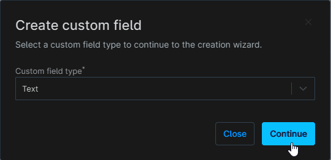
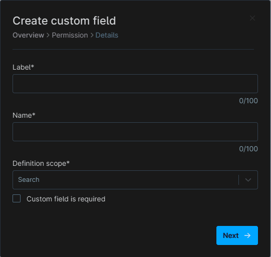
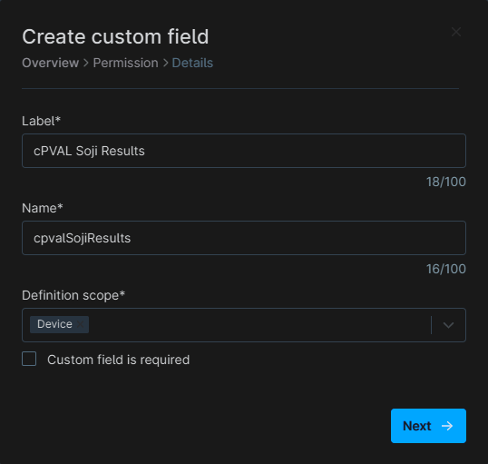
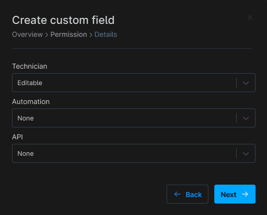
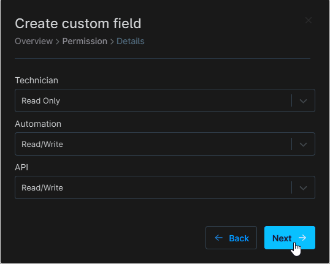
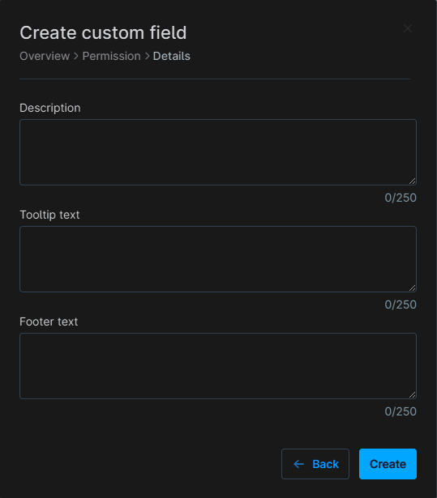
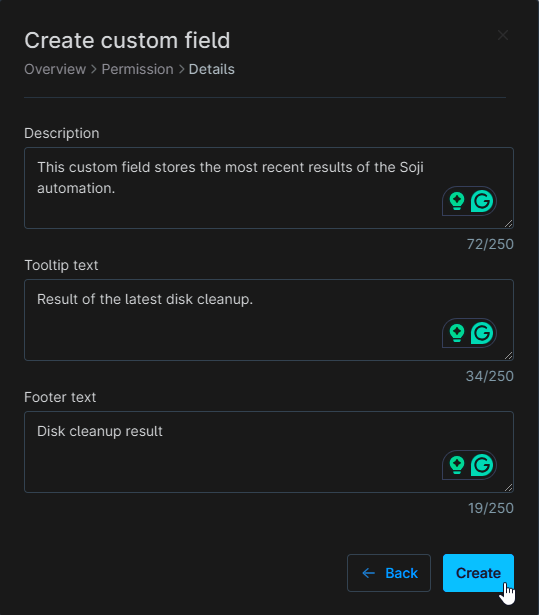
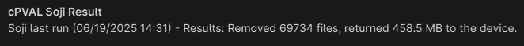

## Summary
This custom field stores the most recent results of the Soji automation.

## Details

| Label | Field Name | Definition Scope | Type | Required | Technician Permission | Automation Permission | API Permission | Description | Tool Tip | Footer Text |
| ----- | ---------- | ---------------- | ---- | -------- |  -------------------- | --------------------- | -------------- | ----------- | -------- | ----------- |
| cPVAL Soji Result | cpvalSojiResult | Device | Text | No | Read Only | Read/Write | Read/Write | This custom field stores the most recent results of the Soji automation | Result of the latest disk cleanup | Disk cleanup result |

## Dependencies

[Soji Disk Cleanup](/docs/ef289b50-fe18-4114-93d0-680437f7c480)

## Custom Field Creation

### Step 1

Navigate to the `Administration` menu, then proceed to `Devices` and select `Global Custom Fields`.  

### Step 2

Locate the `Add` button on the right-hand side of the screen and click on it.  
  

### Step 3

After clicking the `Add` button, select the `Field` button that appears.  

The following Pop-up screen will appear:  

### Step 4

Select the `Text` custom field type from the dropdown menu.

Click the `Continue` button to continue with the custom field creation.

The following Pop-up screen will appear:

### Step 5

Set the following details in the `Overview` section and click the `Next` button.

- Label: `cPVAL Soji Results`
- Name: `cpvalSojiResults`
- Definition Scope: `Device`  
- Custom field is required: `<Leave it unchecked>`

The following Pop-up screen will appear:

### Step 6

Set the following details in the `Permission` section and click the `Next` button.

- Technician: `Read Only`
- Automation: `Read/Write`
- API: `Read/Write`

The following Pop-up screen will appear:

### Step 7

Set the following details in the `Details` section and click the `Create` button to complete the creation of custom field.

- Description: `This custom field stores the most recent results of the Soji automation.`
- Tooltip text: `Result of the latest disk cleanup.`
- Footer text: `Disk cleanup result`

### Example

