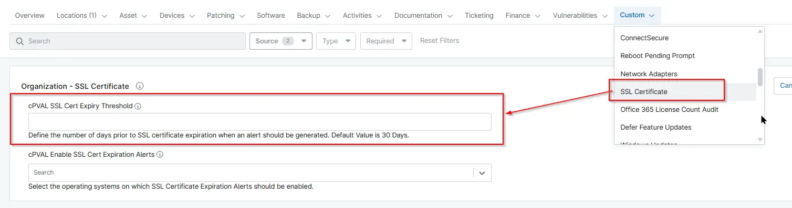

## Summary
Custom Field to define the number of days prior to SSL certificate expiration when an alert should be generated. Certificates that are already expired or are within the configured expiration threshold will be detected and reported. Default Value is 30 Days.

## Details

| Label | Field Name | Definition Scope | Type | Required | Default Value | Technician Permission | Automation Permission | API Permission | Custom Field Tab Name |
| ----- | ---- | ---------------- | ---- | -------- | ------------- | --------------------- | --------------------- | -------------- | ----------- |
|cPVAL SSL Cert Expiry Threshold| cpvalSslCertExpiryThreshold | `Organization`, `Location`, `Device` | Text | False | | Editable | Read_Write | Read_Write | SSL Certificate |  

## Dependencies

- [Solution - SSL Certificate Audit](/docs/cf5acc69-183c-4838-9484-2f3d9a247877)

## Custom Field Creation

- [Custom Field Configuration](https://github.com/ProVal-Tech/ninjarmm/blob/main/custom-fields/cpval-ssl-cert-expiry-threshold.toml)

## Sample Screenshot

## Changelog

### 2026-07-22

- Initial version of the document
